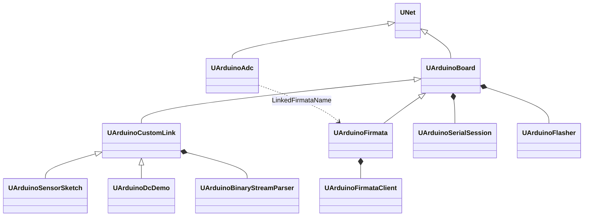
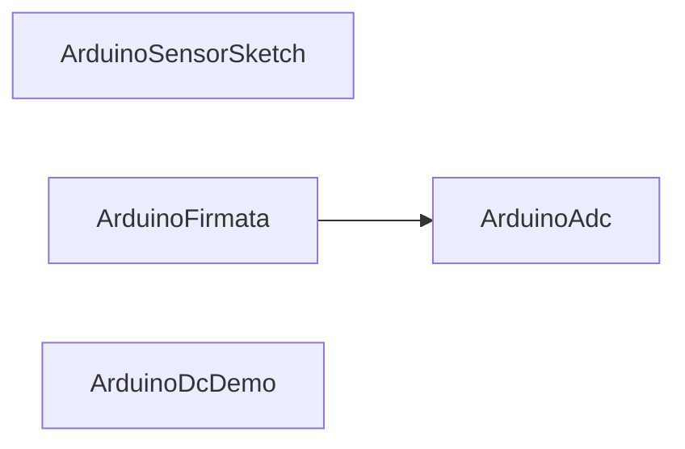

# Архитектура Rdk-HardwareLib

## RU

## Обзор

Библиотека предоставляет Storage-компоненты `UNet` для Arduino и внутренний transport/protocol слой (не в палитре). Расчёт идёт через `ABuild` / `ACalculate` в потоке движка; GUI читает и пульсирует edge-свойства через `MModel_*` API и `envCalculate`.

## Иерархия классов



`UArduinoCustomLink` абстрактен (`OnBinaryFrame` pure virtual) и **не** регистрируется в `UploadClass`.

## Threading (обязательный контракт)

Все методы `UNet` и производных (`ADefault`, `ABuild`, `ACalculate`, `AUnInit`, работа с `UProperty`) вызываются **только из потока движка расчёта** (`UStorage::Calculate` / `envCalculate`).

Запрещено:

- Вызывать `ACalculate`, `EnsureConnected`, `CloseConnection`, менять `UProperty` из слота `QSerialPort::readyRead`.
- Подключать `UArduinoSerialSession::bytesReceived` к коду компонента.
- Восстанавливать `UArduinoConnect` / отдельный `QThread` для вызовов `UNet`.

Модель RX:

| Компонент | Поток | Поведение |
|-----------|-------|-----------|
| `UArduinoSerialSession` | поток владельца `QObject` (обычно Qt main / engine app) | `readyRead` только дописывает `RxBuffer` под mutex; `bytesReceived` **не подключён** в HardwareLib |
| `UArduinoBoard::ACalculate` | Engine | `PollUploadJob()` → edges → serial RX; свойства `UploadProgress` / `UploadLastResult` |
| `UArduinoUploadJob::runSync` | отдельный `QThread` (по умолчанию) | `UArduinoFlasher::flash`; прогресс в `UArduinoUploadJobState`, движок копирует в `PollUploadJob` |
| `UArduinoFlasher::flash` | вызывающий поток (engine при sync, worker при async) | `progressChanged` → job или прямой slot в `RunUploadBlocking` |

`UArduinoAdc` не открывает serial; при `ReadAdcFlag` выставляет флаги на связанном `ArduinoFirmata` и полагается на общий `Calculate` контейнера (вызов `firmata->Calculate()` только из `UArduinoAdc::ACalculate`).

Legacy `UArduinoConnect` (`QThread`) **не используется** — его роль выполняют mutex-буфер + pull в `ACalculate`.

## Регистрация Storage

[`UHardwareLibrary::CreateClassSamples`](../Core/UHardwareLibrary.cpp):

- `ArduinoBoard`, `ArduinoSensorSketch`, `ArduinoFirmata`, `ArduinoAdc`, `ArduinoDcDemo`

## Runtime: цикл `ACalculate`

### UArduinoBoard

```
PollUploadJob → SyncDerivedStates → ProcessBoardEdges → PortChanged →
AutoReconnect → Heartbeat → RequestHealthCheck → OnBoardCalculate → SyncDerivedStates
```

Edge: `Connect`, `Disconnect`, `Reconnect`, `UploadFirmware`, `ClearLastError` (legacy: `UploadFirmwareFlag`).

State: `IsConnected`, `IsOpening`, `HasError`, `IsDisconnected`, `IsUploading`, `UploadComplete`, `UploadProgress`, `UploadLastResult`.

| Этап | Действие |
|------|----------|
| `ABuild` | При `ConnectOnBuild` и непустом `PortName` → `EnsureConnected()` |
| `PollUploadJob` | В начале каждого `ACalculate`: копирует прогресс/статус из `UArduinoUploadJobState`; по `finished` — результат, `UploadJob.reset()`, опционально reconnect |
| `ProcessBoardEdges` | Connect/Disconnect/Reconnect/Upload/ClearLastError |
| Upload (edge) | `validateUploadTargets` → `CloseConnection` → async `startUploadAsync` **или** sync `RunUploadBlocking` (см. ниже) |

**Прошивка (upload):**

- По умолчанию — **асинхронно**: `startUploadAsync()` создаёт `UArduinoUploadJobState` и `QThread` с `UArduinoUploadJob::runSync`; GUI/тесты дергают `envCalculate` / `ACalculate`, чтобы `PollUploadJob` обновлял свойства без блокировки UI.
- **Синхронный путь** (тесты, отладка): переменная окружения `ARDUINO_SYNC_UPLOAD=1` → `RunUploadBlocking()` в потоке движка (`flash` + `msleep` после `CloseConnection`).
- Повторный edge при незавершённом job → `UploadLastResult` = `Upload already in progress`.
- `RunUpload()` — legacy alias на `RunUploadBlocking()` (не вызывается из `ProcessBoardEdges`).

### UArduinoCustomLink / UArduinoSensorSketch / UArduinoDcDemo

```
ProcessCustomLinkEdges → UArduinoBoard::ACalculate → negotiate/process/flush → SyncCustomLinkStates
```

`OnBoardCalculate` (CustomLink): negotiate, `ProcessIncoming`, `FlushCommandQueue`.

`UArduinoSensorSketch`: дополнительно `ProcessSketchEdges` (StartReading, GetPinsInfo, …).

`UArduinoDcDemo`: `ProcessDcDemoEdges` (GetSpeed); speed из `OnBinaryFrame` (тип `0x01`). `LinkedSketchName` — deprecated delegate на один релиз.

### UArduinoFirmata

```
ProcessFirmataEdges → UArduinoBoard::ACalculate → OnBoardCalculate
  → ProcessFirmata (RX) → RunFirmataActions (TX) → BuildPinStatusJson
```

Edge: `RestartFirmata`, `ApplyPinConfig`, `SetPinMode`, `WriteDigital`, `ReadAnalog`, `RefreshPins`, `WritePwm`, `QueryPinState`, …  
State: `PinStatusJson`, `HandshakeStage`, `AnalogPinValue`, `StreamLog`.  
Vector I/O: `AnalogSamples` / `DigitalSamples` (`MDMatrix<double>`, `ptPubOutput | ptPubState`); batch input `DigitalOutputCommands`, `PinConfigBatch`.  
GUI: только properties/edges (`HardwareGuiHelpers`), без прямого доступа к `UArduinoFirmataClient`.

## Transport

См. [Transport.md](Transport.md): `UArduinoSerialSession`, `UArduinoFlasher`, `UArduinoUploadJob`, `UArduinoBoardProfile`, `UArduinoSerialPortUtil` (USB/description auto-detect, `validateUploadTargets`).

## Protocol

См. [Protocol.md](Protocol.md): legacy `0x01`/`0x04`, framed v2, текстовые команды.

## Firmware

`UFirmwareManifest::resolveBundledHex` + env `RDK_HARDWARE_FIRMWARE_DIR`. Манифест: [`Firmware/manifest.json`](../Firmware/manifest.json).

## GUI

Статическая библиотека `Rdk-HardwareLib.gui`, регистрация форм в [`HardwareLibComponentGuiRegistration.cpp`](../GUI/Qt/HardwareLibComponentGuiRegistration.cpp).

Общая вкладка **Board** (`HardwareArduinoBoardPanelWidget`), edge через `HardwareGuiHelpers::pulseEdge`.

См. [GUI.md](GUI.md).

## Типичная схема на canvas



`ArduinoDcDemo` — **один узел** с собственным `PortName` и `sensor_lab_v1` (без `LinkedSketchName`).

## Зависимости CMake

- `Rdk-HardwareLib.qt` — Core + Transport + Protocol
- `Rdk-HardwareLib.gui` — Qt Widgets/Svg, линкуется из NeuroModeler

## См. также

- [Component-Catalog.md](Component-Catalog.md)
- [API-Overview.md](API-Overview.md)
- [Legacy/README.md](Legacy/README.md) — удалённые классы

---

## EN

## Overview

The library provides Storage components `UNet` for Arduino and an internal transport/protocol layer (not in the palette). Calculation runs via `ABuild` / `ACalculate` in the engine thread; the GUI reads and pulses edge properties via the `MModel_*` API and `envCalculate`.

## Class hierarchy


`UArduinoCustomLink` is abstract (`OnBinaryFrame` pure virtual) and is **not** registered in `UploadClass`.

## Threading (mandatory contract)

All `UNet` and derived methods (`ADefault`, `ABuild`, `ACalculate`, `AUnInit`, work with `UProperty`) are called **only from the calculation engine thread** (`UStorage::Calculate` / `envCalculate`).

Forbidden:

- Calling `ACalculate`, `EnsureConnected`, `CloseConnection`, or changing `UProperty` from a `QSerialPort::readyRead` slot.
- Connecting `UArduinoSerialSession::bytesReceived` to component code.
- Restoring `UArduinoConnect` / a separate `QThread` for `UNet` calls.

RX model:

| Component | Thread | Behavior |
|-----------|--------|----------|
| `UArduinoSerialSession` | Owner `QObject` thread (usually Qt main / engine app) | `readyRead` only appends to `RxBuffer` under mutex; `bytesReceived` is **not connected** in HardwareLib |
| `UArduinoBoard::ACalculate` | Engine | `PollUploadJob()` → edges → serial RX; properties `UploadProgress` / `UploadLastResult` |
| `UArduinoUploadJob::runSync` | Separate `QThread` (default) | `UArduinoFlasher::flash`; progress in `UArduinoUploadJobState`, engine copies in `PollUploadJob` |
| `UArduinoFlasher::flash` | Calling thread (engine when sync, worker when async) | `progressChanged` → job or direct slot in `RunUploadBlocking` |

`UArduinoAdc` does not open serial; on `ReadAdcFlag` it sets flags on the linked `ArduinoFirmata` and relies on the container's shared `Calculate` (`firmata->Calculate()` called only from `UArduinoAdc::ACalculate`).

Legacy `UArduinoConnect` (`QThread`) is **not used** — its role is fulfilled by mutex buffer + pull in `ACalculate`.

## Storage registration

[`UHardwareLibrary::CreateClassSamples`](../Core/UHardwareLibrary.cpp):

- `ArduinoBoard`, `ArduinoSensorSketch`, `ArduinoFirmata`, `ArduinoAdc`, `ArduinoDcDemo`

## Runtime: `ACalculate` cycle

### UArduinoBoard

```
PollUploadJob → SyncDerivedStates → ProcessBoardEdges → PortChanged →
AutoReconnect → Heartbeat → RequestHealthCheck → OnBoardCalculate → SyncDerivedStates
```

Edge: `Connect`, `Disconnect`, `Reconnect`, `UploadFirmware`, `ClearLastError` (legacy: `UploadFirmwareFlag`).

State: `IsConnected`, `IsOpening`, `HasError`, `IsDisconnected`, `IsUploading`, `UploadComplete`, `UploadProgress`, `UploadLastResult`.

| Stage | Action |
|-------|--------|
| `ABuild` | If `ConnectOnBuild` and non-empty `PortName` → `EnsureConnected()` |
| `PollUploadJob` | At the start of each `ACalculate`: copies progress/status from `UArduinoUploadJobState`; on `finished` — result, `UploadJob.reset()`, optional reconnect |
| `ProcessBoardEdges` | Connect/Disconnect/Reconnect/Upload/ClearLastError |
| Upload (edge) | `validateUploadTargets` → `CloseConnection` → async `startUploadAsync` **or** sync `RunUploadBlocking` (see below) |

**Firmware upload:**

- By default — **asynchronous**: `startUploadAsync()` creates `UArduinoUploadJobState` and a `QThread` with `UArduinoUploadJob::runSync`; GUI/tests call `envCalculate` / `ACalculate` so `PollUploadJob` updates properties without blocking the UI.
- **Synchronous path** (tests, debugging): environment variable `ARDUINO_SYNC_UPLOAD=1` → `RunUploadBlocking()` in the engine thread (`flash` + `msleep` after `CloseConnection`).
- Repeated edge while job is incomplete → `UploadLastResult` = `Upload already in progress`.
- `RunUpload()` — legacy alias for `RunUploadBlocking()` (not called from `ProcessBoardEdges`).

### UArduinoCustomLink / UArduinoSensorSketch / UArduinoDcDemo

```
ProcessCustomLinkEdges → UArduinoBoard::ACalculate → negotiate/process/flush → SyncCustomLinkStates
```

`OnBoardCalculate` (CustomLink): negotiate, `ProcessIncoming`, `FlushCommandQueue`.

`UArduinoSensorSketch`: additionally `ProcessSketchEdges` (StartReading, GetPinsInfo, …).

`UArduinoDcDemo`: `ProcessDcDemoEdges` (GetSpeed); speed from `OnBinaryFrame` (type `0x01`). `LinkedSketchName` — deprecated delegate for one release.

### UArduinoFirmata

```
ProcessFirmataEdges → UArduinoBoard::ACalculate → OnBoardCalculate
  → ProcessFirmata (RX) → RunFirmataActions (TX) → BuildPinStatusJson
```

Edge: `RestartFirmata`, `ApplyPinConfig`, `SetPinMode`, `WriteDigital`, `ReadAnalog`, `RefreshPins`, `WritePwm`, `QueryPinState`, …  
State: `PinStatusJson`, `HandshakeStage`, `AnalogPinValue`, `StreamLog`.  
Vector I/O: `AnalogSamples` / `DigitalSamples` (`MDMatrix<double>`, `ptPubOutput | ptPubState`); batch input `DigitalOutputCommands`, `PinConfigBatch`.  
GUI: properties/edges only (`HardwareGuiHelpers`), no direct access to `UArduinoFirmataClient`.

## Transport

See [Transport.md](Transport.md): `UArduinoSerialSession`, `UArduinoFlasher`, `UArduinoUploadJob`, `UArduinoBoardProfile`, `UArduinoSerialPortUtil` (USB/description auto-detect, `validateUploadTargets`).

## Protocol

See [Protocol.md](Protocol.md): legacy `0x01`/`0x04`, framed v2, text commands.

## Firmware

`UFirmwareManifest::resolveBundledHex` + env `RDK_HARDWARE_FIRMWARE_DIR`. Manifest: [`Firmware/manifest.json`](../Firmware/manifest.json).

## GUI

Static library `Rdk-HardwareLib.gui`, form registration in [`HardwareLibComponentGuiRegistration.cpp`](../GUI/Qt/HardwareLibComponentGuiRegistration.cpp).

Shared **Board** tab (`HardwareArduinoBoardPanelWidget`), edge via `HardwareGuiHelpers::pulseEdge`.

See [GUI.md](GUI.md).

## Typical canvas layout


`ArduinoDcDemo` is a **single node** with its own `PortName` and `sensor_lab_v1` (without `LinkedSketchName`).

## CMake dependencies

- `Rdk-HardwareLib.qt` — Core + Transport + Protocol
- `Rdk-HardwareLib.gui` — Qt Widgets/Svg, linked from NeuroModeler

## See also

- [Component-Catalog.md](Component-Catalog.md)
- [API-Overview.md](API-Overview.md)
- [Legacy/README.md](Legacy/README.md) — removed classes
