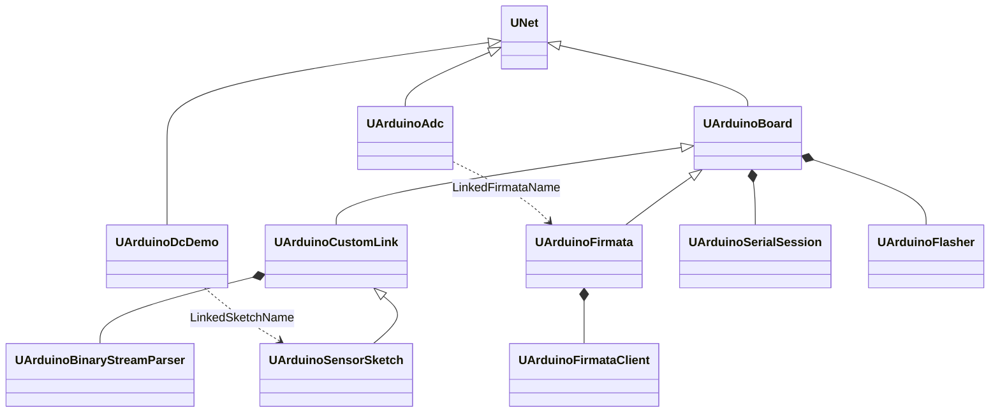
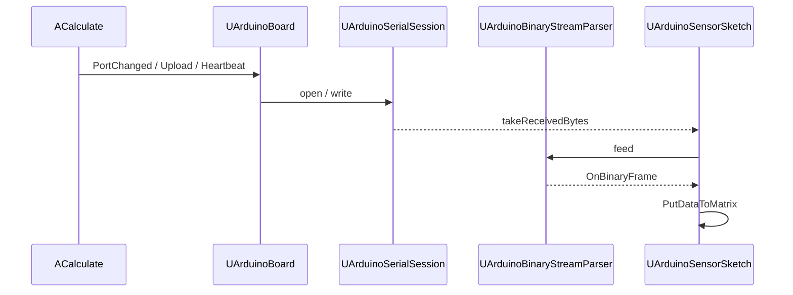
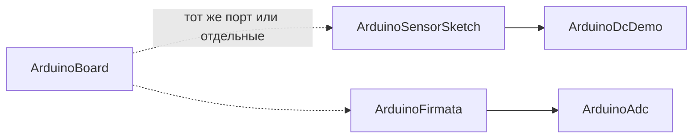

# Архитектура Rdk-HardwareLib

## Обзор

Библиотека предоставляет Storage-компоненты `UNet` для Arduino и внутренний transport/protocol слой (не в палитре). Расчёт идёт через `ABuild` / `ACalculate` в потоке движка; GUI читает свойства через `MModel_*` API.

## Иерархия классов

`UArduinoCustomLink` абстрактен (`OnBinaryFrame` pure virtual) и **не** регистрируется в `UploadClass`.

## Регистрация Storage

[`UHardwareLibrary::CreateClassSamples`](../Core/UHardwareLibrary.cpp):

- `ArduinoBoard`, `ArduinoSensorSketch`, `ArduinoFirmata`, `ArduinoAdc`, `ArduinoDcDemo`

## Runtime: цикл `ACalculate`

### UArduinoBoard

| Этап | Действие |
|------|----------|
| `ABuild` | При `ConnectOnBuild` и непустом `PortName` → `EnsureConnected()` |
| `ACalculate` | Смена порта, `UploadFirmwareFlag`, heartbeat, `RequestHealthCheck`, затем `OnBoardCalculate()` |
| `EnsureConnected` | `ConnectionState`: Opening → Connected / Error, `LastError` |
| `RunUpload` | `Disconnect` → `UArduinoFlasher::flash` → опционально reconnect |

### UArduinoCustomLink / UArduinoSensorSketch

После `UArduinoBoard::ACalculate`:

1. Команды из `InputCommand` / `SendCommandFlag` → очередь → `Session->write` (когда `bytesToWrite()==0`).
2. `ProcessIncoming` → parser → `OnBinaryFrame`.
3. `OnHealthCheck` → `GET STATUS\n`.

### UArduinoFirmata

После connect: handshake (`UArduinoFirmataClient`) — firmware version, capability, analog mapping → `FirmataReady`.

Edge flags: `SetPinModeFlag`, `WriteDigitalFlag`, `ReadAnalogFlag`.

## Transport

См. [Transport.md](Transport.md): `UArduinoSerialSession`, `UArduinoFlasher`, `UArduinoBoardProfile`, `UArduinoSerialPortUtil`.

## Protocol

См. [Protocol.md](Protocol.md): legacy `0x01`/`0x04`, framed v2, текстовые команды.

## Firmware

`UFirmwareManifest::resolveBundledHex` + env `RDK_HARDWARE_FIRMWARE_DIR`. Манифест: [`Firmware/manifest.json`](../Firmware/manifest.json).

## GUI

Статическая библиотека `Rdk-HardwareLib.gui`, регистрация форм в [`HardwareLibComponentGuiRegistration.cpp`](../GUI/Qt/HardwareLibComponentGuiRegistration.cpp).

См. [GUI.md](GUI.md).

## Типичная схема на canvas

На практике часто один `ArduinoSensorSketch` с собственным `PortName` или пара Board + Sketch с общим портом после upload.

## Зависимости CMake

- `Rdk-HardwareLib.qt` — Core + Transport + Protocol
- `Rdk-HardwareLib.gui` — Qt Widgets/Svg, линкуется из NeuroModeler

## См. также

- [Component-Catalog.md](Component-Catalog.md)
- [API-Overview.md](API-Overview.md)
- [Legacy/README.md](Legacy/README.md) — удалённые классы
