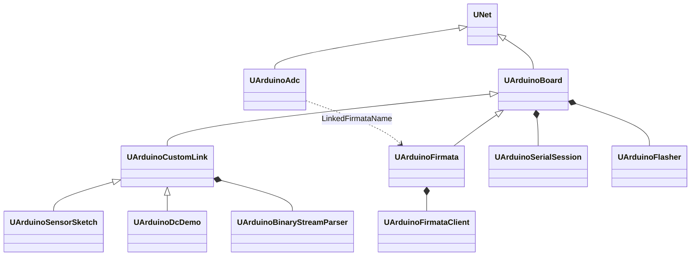
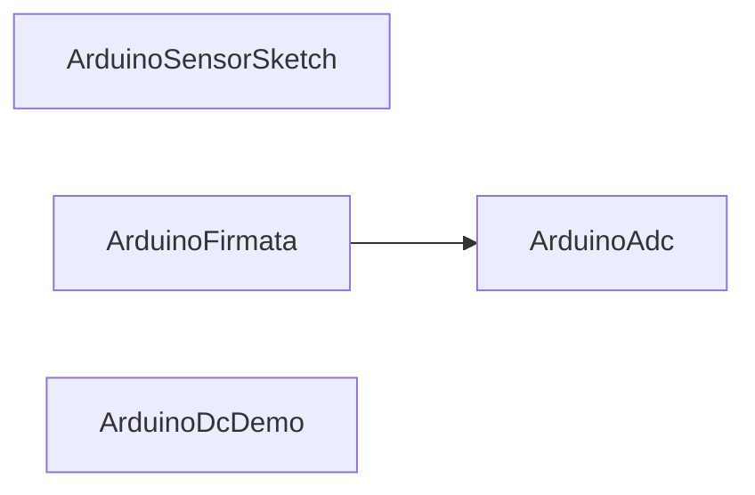

# Архитектура Rdk-HardwareLib

## Обзор

Библиотека предоставляет Storage-компоненты `UNet` для Arduino и внутренний transport/protocol слой (не в палитре). Расчёт идёт через `ABuild` / `ACalculate` в потоке движка; GUI читает и пульсирует edge-свойства через `MModel_*` API и `envCalculate`.

## Иерархия классов



`UArduinoCustomLink` абстрактен (`OnBinaryFrame` pure virtual) и **не** регистрируется в `UploadClass`.

## Threading (обязательный контракт)

Все методы `UNet` и производных (`ADefault`, `ABuild`, `ACalculate`, `AUnInit`, работа с `UProperty`) вызываются **только из потока движка расчёта** (`UStorage::Calculate` / `envCalculate`).

Запрещено:

- Вызывать `ACalculate`, `EnsureConnected`, `CloseConnection`, менять `UProperty` из слота `QSerialPort::readyRead`.
- Подключать `UArduinoSerialSession::bytesReceived` к коду компонента.
- Восстанавливать `UArduinoConnect` / отдельный `QThread` для вызовов `UNet`.

Модель RX:

| Компонент | Поток | Поведение |
|-----------|-------|-----------|
| `UArduinoSerialSession` | поток владельца `QObject` (обычно Qt main / engine app) | `readyRead` только дописывает `RxBuffer` под mutex; `bytesReceived` **не подключён** в HardwareLib |
| `UArduinoBoard::ACalculate` | Engine | `takeReceivedBytes()` → parse → свойства |
| `UArduinoFlasher::flash` | синхронно из `RunUpload` в `ACalculate` | прогресс пишет `UploadProgress` в том же потоке |

`UArduinoAdc` не открывает serial; при `ReadAdcFlag` выставляет флаги на связанном `ArduinoFirmata` и полагается на общий `Calculate` контейнера (вызов `firmata->Calculate()` только из `UArduinoAdc::ACalculate`).

Legacy `UArduinoConnect` (`QThread`) **не используется** — его роль выполняют mutex-буфер + pull в `ACalculate`.

## Регистрация Storage

[`UHardwareLibrary::CreateClassSamples`](../Core/UHardwareLibrary.cpp):

- `ArduinoBoard`, `ArduinoSensorSketch`, `ArduinoFirmata`, `ArduinoAdc`, `ArduinoDcDemo`

## Runtime: цикл `ACalculate`

### UArduinoBoard

```
SyncDerivedStates → ProcessBoardEdges → PortChanged → AutoReconnect →
Heartbeat → RequestHealthCheck → OnBoardCalculate → SyncDerivedStates
```

Edge: `Connect`, `Disconnect`, `Reconnect`, `UploadFirmware`, `ClearLastError` (legacy: `UploadFirmwareFlag`).

State: `IsConnected`, `IsOpening`, `HasError`, `IsDisconnected`, `IsUploading`, `UploadComplete`.

| Этап | Действие |
|------|----------|
| `ABuild` | При `ConnectOnBuild` и непустом `PortName` → `EnsureConnected()` |
| `ProcessBoardEdges` | Connect/Disconnect/Reconnect/Upload/ClearLastError |
| `RunUpload` | `CloseConnection` → `UArduinoFlasher::flash` → опционально reconnect |

### UArduinoCustomLink / UArduinoSensorSketch / UArduinoDcDemo

```
ProcessCustomLinkEdges → UArduinoBoard::ACalculate → negotiate/process/flush → SyncCustomLinkStates
```

`OnBoardCalculate` (CustomLink): negotiate, `ProcessIncoming`, `FlushCommandQueue`.

`UArduinoSensorSketch`: дополнительно `ProcessSketchEdges` (StartReading, GetPinsInfo, …).

`UArduinoDcDemo`: `ProcessDcDemoEdges` (GetSpeed); speed из `OnBinaryFrame` (тип `0x01`). `LinkedSketchName` — deprecated delegate на один релиз.

### UArduinoFirmata

```
ProcessFirmataEdges → UArduinoBoard::ACalculate → OnBoardCalculate
  → ProcessFirmata (RX) → RunFirmataActions (TX) → BuildPinStatusJson
```

Edge: `RestartFirmata`, `ApplyPinConfig`, `SetPinMode`, `WriteDigital`, `ReadAnalog`, `RefreshPins`, `WritePwm`, `QueryPinState`, …  
State: `PinStatusJson`, `HandshakeStage`, `AnalogPinValue`, `StreamLog`.  
Vector I/O: `AnalogSamples` / `DigitalSamples` (`MDMatrix<double>`, `ptPubOutput | ptPubState`); batch input `DigitalOutputCommands`, `PinConfigBatch`.  
GUI: только properties/edges (`HardwareGuiHelpers`), без прямого доступа к `UArduinoFirmataClient`.

## Transport

См. [Transport.md](Transport.md): `UArduinoSerialSession`, `UArduinoFlasher`, `UArduinoBoardProfile`, `UArduinoSerialPortUtil`.

## Protocol

См. [Protocol.md](Protocol.md): legacy `0x01`/`0x04`, framed v2, текстовые команды.

## Firmware

`UFirmwareManifest::resolveBundledHex` + env `RDK_HARDWARE_FIRMWARE_DIR`. Манифест: [`Firmware/manifest.json`](../Firmware/manifest.json).

## GUI

Статическая библиотека `Rdk-HardwareLib.gui`, регистрация форм в [`HardwareLibComponentGuiRegistration.cpp`](../GUI/Qt/HardwareLibComponentGuiRegistration.cpp).

Общая вкладка **Board** (`HardwareArduinoBoardPanelWidget`), edge через `HardwareGuiHelpers::pulseEdge`.

См. [GUI.md](GUI.md).

## Типичная схема на canvas



`ArduinoDcDemo` — **один узел** с собственным `PortName` и `sensor_lab_v1` (без `LinkedSketchName`).

## Зависимости CMake

- `Rdk-HardwareLib.qt` — Core + Transport + Protocol
- `Rdk-HardwareLib.gui` — Qt Widgets/Svg, линкуется из NeuroModeler

## См. также

- [Component-Catalog.md](Component-Catalog.md)
- [API-Overview.md](API-Overview.md)
- [Legacy/README.md](Legacy/README.md) — удалённые классы
