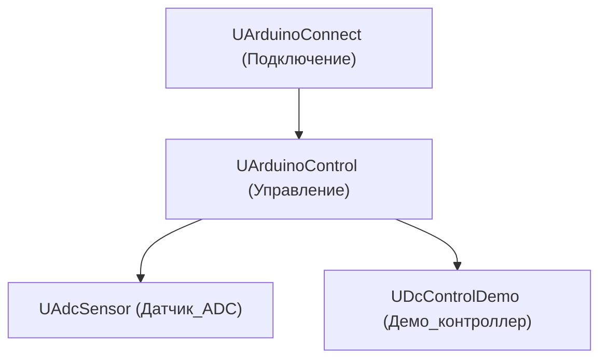
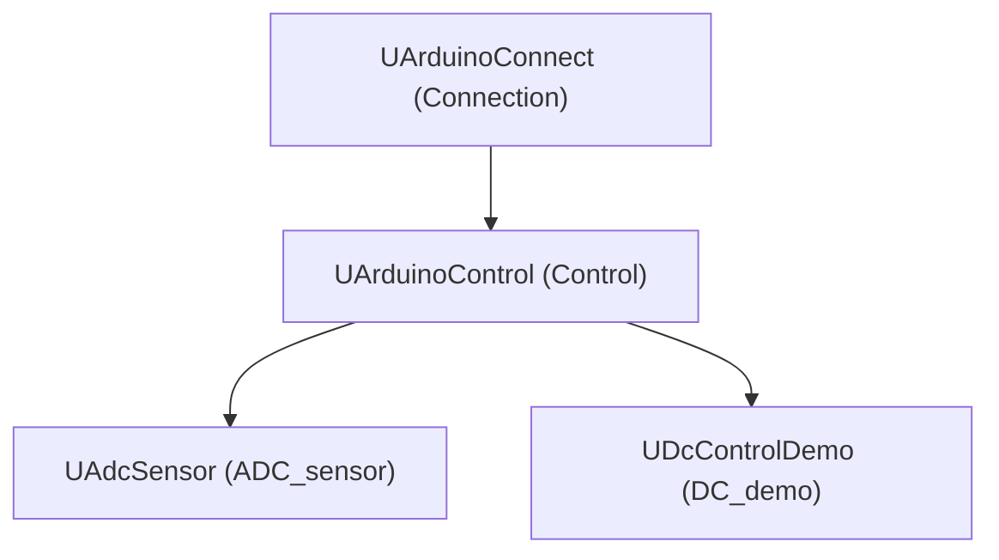

# Архитектура Rdk-HardwareLib

## RU

### Обзор

Rdk-HardwareLib предоставляет компонентный интерфейс для работы с аппаратным обеспечением через последовательные порты.

### Структура библиотеки



### Основные модули

#### Подключение к Arduino

- **UArduinoConnect** - компонент для установления соединения с платой Arduino через последовательный порт (Serial/UART). Управляет подключением, настройкой параметров связи и обменом данными.
  
  **Основные функции:**
  - Подключение к Arduino по COM-порту
  - Настройка скорости передачи (baud rate)
  - Отправка команд на Arduino
  - Получение данных от Arduino

#### Управление Arduino

- **UArduinoControl** - компонент для управления Arduino, отправки команд управления и получения состояния. Расширяет функциональность UArduinoConnect для конкретных задач управления.
  
  **Основные функции:**
  - Управление выходами (digital/analog)
  - Чтение входов
  - Управление сервоприводами
  - Управление моторами

#### Датчики

- **UAdcSensor** - компонент для работы с аналоговыми датчиками через ADC (Analog-to-Digital Converter) Arduino. Позволяет читать значения с аналоговых входов.
  
  **Основные функции:**
  - Чтение значений с аналоговых входов
  - Калибровка датчиков
  - Преобразование значений

#### Демо контроллеры

- **UDcControlDemo** - демонстрационный компонент для управления DC-двигателями. Используется для тестирования и примеров работы с двигателями через Arduino.
  
  **Основные функции:**
  - Управление скоростью двигателя
  - Управление направлением вращения
  - Обратная связь по положению

### Ключевые классы

#### UHardwareLibrary

Главный класс библиотеки:

```cpp
class UHardwareLibrary: public ULibrary
{
public:
    UHardwareLibrary(void);
    virtual void CreateClassSamples(UStorage *storage);
};
```

Библиотека автоматически загружается при инициализации:

```cpp
libs_list.push_back(&RDK::HardwareLibrary);
```

#### UArduinoConnect

Базовый компонент для работы с Arduino:

```cpp
class UArduinoConnect: public UComponent
{
    // Свойства для настройки подключения
    // - COM порт
    // - Скорость передачи
    // - Таймауты
    
    // Методы для:
    // - Подключения/отключения
    // - Отправки данных
    // - Получения данных
};
```

### Зависимости

- **rdk.static.qt** - ядро Rdk (обязательно)
- Стандартная библиотека C++
- Платформо-зависимые библиотеки для работы с последовательными портами:
  - Windows: WinAPI для COM-портов
  - Linux: termios для последовательных портов

### Зависимости от этой библиотеки

- **Nmsdk-MotionControlLib** - использует компоненты работы с железом для управления двигателями и датчиками в робототехнических системах

### Примеры использования

#### Подключение к Arduino

```cpp
// Создание компонента подключения
UArduinoConnect* arduino = storage->CreateComponent<UArduinoConnect>();
// Настройка COM-порта и скорости
arduino->SetComPort("COM3");
arduino->SetBaudRate(9600);
// Подключение
arduino->Connect();
```

#### Чтение датчика

```cpp
// Создание компонента датчика
UAdcSensor* sensor = storage->CreateComponent<UAdcSensor>();
// Настройка пина и подключение к Arduino
sensor->SetPin(0); // Аналоговый пин A0
sensor->ConnectToArduino(arduino);
// Чтение значения
double value = sensor->ReadValue();
```

#### Управление двигателем

```cpp
// Создание демо контроллера двигателя
UDcControlDemo* motor = storage->CreateComponent<UDcControlDemo>();
// Настройка пинов и подключение к Arduino
motor->SetPins(9, 10); // PWM и направление
motor->ConnectToArduino(arduino);
// Управление скоростью
motor->SetSpeed(0.5); // 50% мощности
```

### Интеграция с Arduino скетчами

Библиотека предполагает наличие соответствующего кода на стороне Arduino для обработки команд и отправки данных. Пример скетча может быть предоставлен в документации или примерах.

### Файлы библиотеки

#### Core компоненты

- `UHardwareLibrary.h` - главный класс библиотеки
- `UArduinoConnect.h/cpp` - подключение к Arduino
- `UArduinoControl.h/cpp` - управление Arduino
- `UAdcSensor.h/cpp` - работа с датчиками
- `UDcControlDemo.h/cpp` - демо контроллер двигателя

### См. также

- [Usage-Examples.md](Usage-Examples.md) - примеры использования
- [API-Overview.md](API-Overview.md) - обзор API

---

## EN

### Overview

Rdk-HardwareLib provides a component interface for working with hardware through serial ports.

### Library Structure



The library is organized around a simple control chain: connect to the device, send/receive commands, read sensors, and drive actuators. Qt SerialPort is typically used under the hood for communication.

### Main Modules

#### Arduino Connection

- **UArduinoConnect** - component for establishing connection with Arduino board via serial port (Serial/UART). Manages connection, communication parameters setup, and data exchange.
  
  **Main functions:**
  - Connect to Arduino via COM port
  - Configure transmission speed (baud rate)
  - Send commands to Arduino
  - Receive data from Arduino

#### Arduino Control

- **UArduinoControl** - component for Arduino control, sending control commands and getting status. Extends UArduinoConnect functionality for specific control tasks.
  
  **Main functions:**
  - Control outputs (digital/analog)
  - Read inputs
  - Control servos
  - Control motors

#### Sensors

- **UAdcSensor** - component for working with analog sensors via Arduino ADC (Analog-to-Digital Converter). Allows reading values from analog inputs.
  
  **Main functions:**
  - Read values from analog inputs
  - Sensor calibration
  - Value transformation

#### Demo Controllers

- **UDcControlDemo** - demonstration component for DC motor control. Used for testing and examples of motor work through Arduino.
  
  **Main functions:**
  - Motor speed control
  - Rotation direction control
  - Position feedback

### Key Classes

#### UHardwareLibrary

Main library class:

```cpp
class UHardwareLibrary: public ULibrary
{
public:
    UHardwareLibrary(void);
    virtual void CreateClassSamples(UStorage *storage);
};
```

The library is automatically loaded during initialization:

```cpp
libs_list.push_back(&RDK::HardwareLibrary);
```

#### UArduinoConnect

Base component for working with Arduino:

```cpp
class UArduinoConnect: public UComponent
{
    // Properties for connection setup
    // - COM port
    // - Transmission speed
    // - Timeouts
    
    // Methods for:
    // - Connection/disconnection
    // - Sending data
    // - Receiving data
};
```

### Dependencies

- **rdk.static.qt** - Rdk core (required)
- Standard C++ library
- Platform-dependent libraries for serial port operations:
  - Windows: WinAPI for COM ports
  - Linux: termios for serial ports

### Libraries Depending on This Library

- **Nmsdk-MotionControlLib** - uses hardware components for motor and sensor control in robotic systems

### Usage Examples

#### Arduino Connection

```cpp
// Create connection component
UArduinoConnect* arduino = storage->CreateComponent<UArduinoConnect>();
// Configure COM port and speed
arduino->SetComPort("COM3");
arduino->SetBaudRate(9600);
// Connect
arduino->Connect();
```

#### Sensor Reading

```cpp
// Create sensor component
UAdcSensor* sensor = storage->CreateComponent<UAdcSensor>();
// Configure pin and connect to Arduino
sensor->SetPin(0); // Analog pin A0
sensor->ConnectToArduino(arduino);
// Read value
double value = sensor->ReadValue();
```

#### Motor Control

```cpp
// Create motor demo controller
UDcControlDemo* motor = storage->CreateComponent<UDcControlDemo>();
// Configure pins and connect to Arduino
motor->SetPins(9, 10); // PWM and direction
motor->ConnectToArduino(arduino);
// Control speed
motor->SetSpeed(0.5); // 50% power
```

### Integration with Arduino Sketches

The library assumes the presence of corresponding code on the Arduino side for command processing and data sending. Example sketch may be provided in documentation or examples.

### Library Files

#### Core Components

- `UHardwareLibrary.h` - main library class
- `UArduinoConnect.h/cpp` - Arduino connection
- `UArduinoControl.h/cpp` - Arduino control
- `UAdcSensor.h/cpp` - sensor operations
- `UDcControlDemo.h/cpp` - motor demo controller

### See Also

- [Usage-Examples.md](Usage-Examples.md) - usage examples
- [API-Overview.md](API-Overview.md) - API overview
