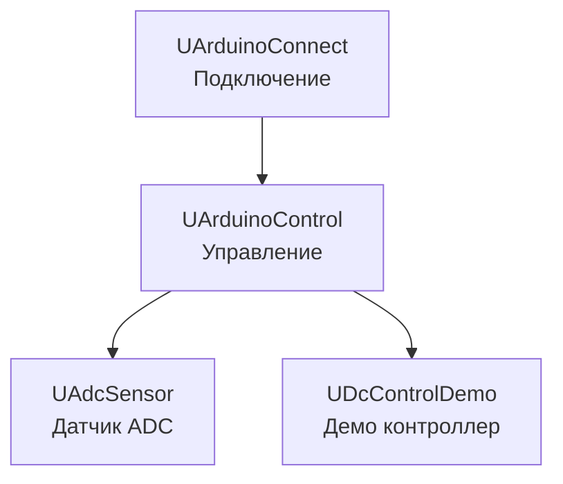

# Архитектура Rdk-HardwareLib

## RU

### Обзор

Rdk-HardwareLib предоставляет компонентный интерфейс для работы с аппаратным обеспечением через последовательные порты.

### Структура библиотеки

### Основные модули

#### Подключение к Arduino

- **UArduinoConnect** - подключение к Arduino через последовательный порт

#### Управление Arduino

- **UArduinoControl** - управление Arduino, отправка команд

#### Датчики

- **UAdcSensor** - работа с ADC датчиками

#### Демо контроллеры

- **UDcControlDemo** - демонстрационный контроллер DC-двигателя

### Зависимости

- `rdk.static.qt` - ядро Rdk
- Qt5 (SerialPort) - для работы с последовательными портами

### См. также

- [Usage-Examples.md](Usage-Examples.md) - примеры использования
- [API-Overview.md](API-Overview.md) - обзор API

---

## EN

### Overview

Rdk-HardwareLib provides a component interface for working with hardware through serial ports.

### Library Structure

### Main Modules

#### Arduino Connection

- **UArduinoConnect** - connection to Arduino via serial port

#### Arduino Control

- **UArduinoControl** - Arduino control, command sending

#### Sensors

- **UAdcSensor** - ADC sensor operations

#### Demo Controllers

- **UDcControlDemo** - DC motor demo controller

### Dependencies

- `rdk.static.qt` - Rdk core
- Qt5 (SerialPort) - for serial port operations

### See Also

- [Usage-Examples.md](Usage-Examples.md) - usage examples
- [API-Overview.md](API-Overview.md) - API overview
