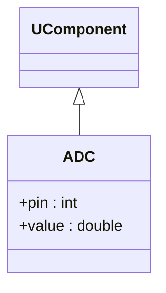

## ADC — аналоговый сенсор (Rdk-HardwareLib)

**Класс**: `ADC` — читает аналоговые значения с пинов Arduino.  
**Storage-компонент**: `UploadClass("ADC", ...)`.

### Входы/выходы
- Вход: ссылка на соединение `Arduino`, номер пина.
- Выход: измеренное аналоговое значение (напряжение/нормализованный уровень).

---

## ADC — analog sensor (Rdk-HardwareLib)

Reads analog pin values via existing Arduino connection.

