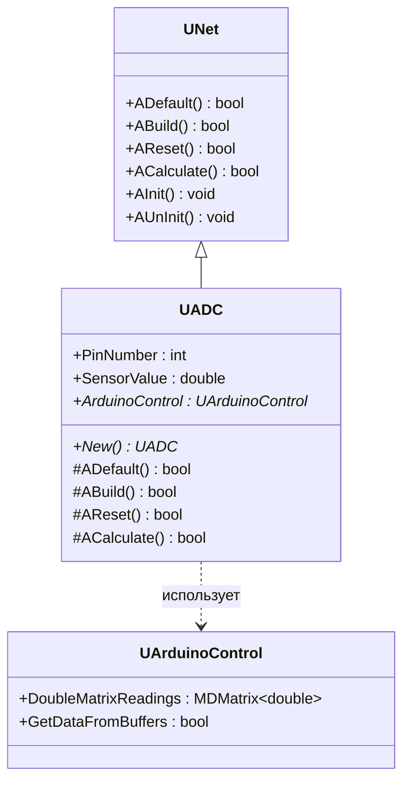
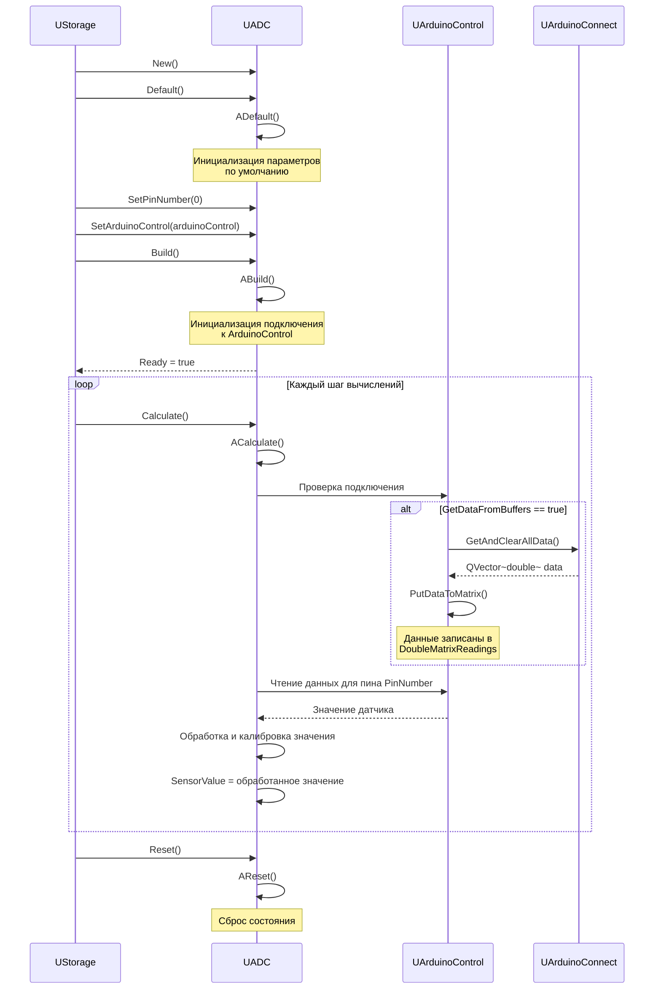
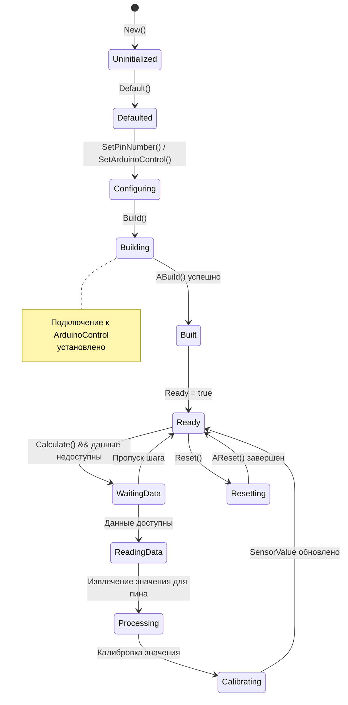
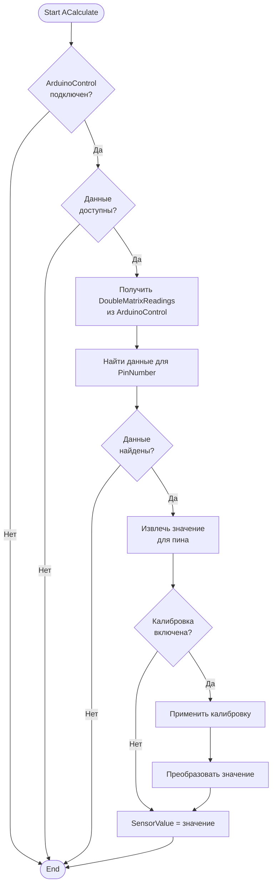
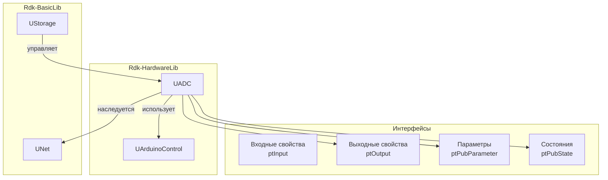
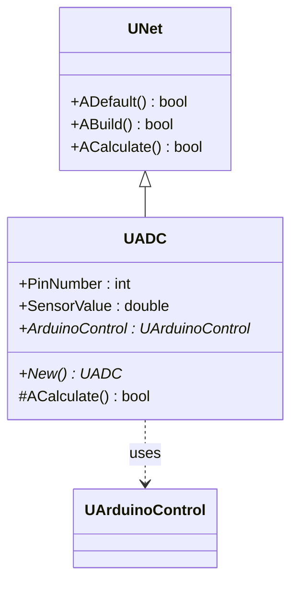
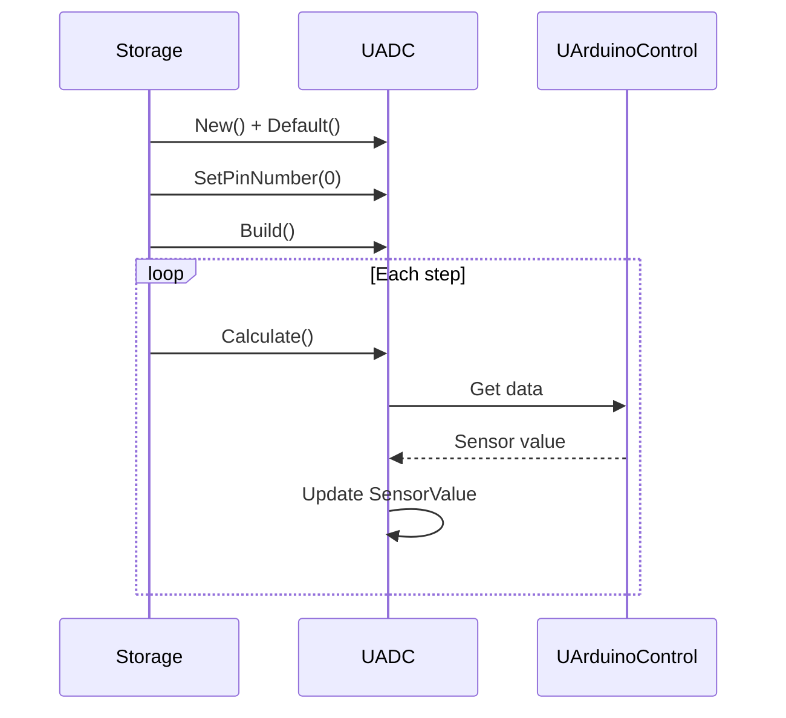
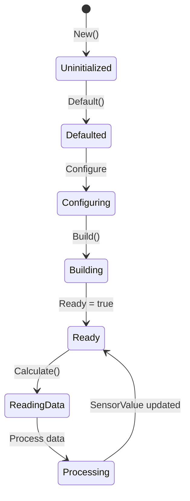
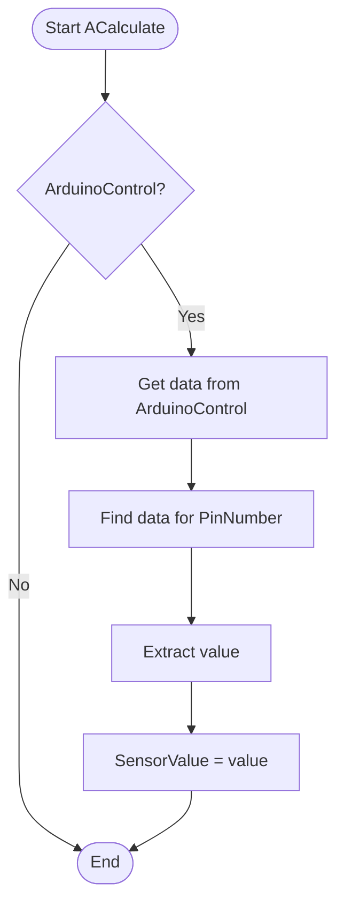
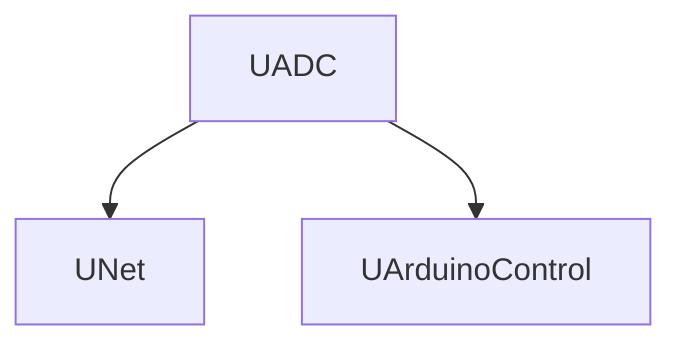

# ADC — аналоговый сенсор (Rdk-HardwareLib)

## RU

### Назначение

**Класс**: `UADC` — компонент для работы с аналоговыми датчиками через ADC (Analog-to-Digital Converter) Arduino.  
**Регистрация**: `UHardwareLibrary.cpp` → `UploadClass("ADC", ...)`.  
**Storage-инстансы**: `ClassName = "ADC"` в `Bin/Configs/*/Model_*.xml`.

`UADC` расширяет `UNet` функциональностью чтения аналоговых значений с пинов Arduino. Позволяет читать значения с аналоговых входов, выполнять калибровку датчиков и преобразование значений. В текущей реализации класс является базовым и требует расширения для полной функциональности.

**Примечание:** Текущая реализация компонента минимальна (пустой класс). Документация описывает предполагаемый интерфейс на основе архитектуры библиотеки и примеров использования.

### UML-диаграмма классов



**Иерархия наследования:**
- `UNet` — базовый класс сетевого компонента из Rdk-BasicLib
- `UADC` — компонент для работы с аналоговыми датчиками

**Связи с другими компонентами:**
- `UADC` использует `UArduinoControl` для получения данных с Arduino (зависимость)
- `UArduinoControl` предоставляет данные через `DoubleMatrixReadings`

**Примечание:** В текущей реализации класс `UADC` пустой. Предполагаемый интерфейс описан на основе архитектуры библиотеки и примеров использования.

### UML-диаграмма последовательности



**Жизненный цикл (предполагаемый):**
1. **Создание** — компонент создается через конструктор
2. **Инициализация** — установка параметров по умолчанию через `ADefault()`
3. **Настройка** — установка номера пина и ссылки на `UArduinoControl`
4. **Сборка** — инициализация подключения к `UArduinoControl` через `ABuild()`
5. **Вычисления** — в каждом шаге:
   - Получение данных из `UArduinoControl`
   - Извлечение значения для указанного пина
   - Обработка и калибровка значения
   - Обновление `SensorValue`
6. **Сброс** — сброс состояния через `AReset()`

### UML-диаграмма состояний



**Состояния (предполагаемые):**
- **Uninitialized** — создан, но не инициализирован
- **Defaulted** — параметры установлены по умолчанию
- **Configuring** — настройка параметров (номер пина, ArduinoControl)
- **Building** — выполняется сборка структуры
- **Built** — структура построена, подключение установлено
- **Ready** — готов к выполнению расчетов
- **WaitingData** — ожидание данных от ArduinoControl
- **ReadingData** — чтение данных из ArduinoControl
- **Processing** — обработка данных для указанного пина
- **Calibrating** — калибровка значения датчика
- **Resetting** — выполняется сброс состояний

### UML-диаграмма активности



**Алгоритм работы ACalculate() (предполагаемый):**
1. Проверка наличия подключения к `UArduinoControl`
2. Проверка доступности данных в `DoubleMatrixReadings`
3. Поиск данных для указанного пина (`PinNumber`)
4. Извлечение значения для пина
5. Применение калибровки (если включена)
6. Преобразование значения (если необходимо)
7. Обновление `SensorValue`

### UML-диаграмма компонентов



**Зависимости:**
- **Rdk-BasicLib** — базовые классы (`UNet`, `UStorage`, `UProperty`)
- **UArduinoControl** — компонент управления Arduino (для получения данных)

**Интерфейсы (предполагаемые):**
- **Входы** — свойства с флагом `ptInput`: отсутствуют
- **Выходы** — свойства с флагом `ptOutput`: `SensorValue`
- **Параметры** — свойства с флагом `ptPubParameter`: `PinNumber`, `ArduinoControl`
- **Состояния** — свойства с флагом `ptPubState`: `SensorValue`

### Свойства

**Примечание:** В текущей реализации класс пустой. Свойства описаны на основе предполагаемого интерфейса.

#### Параметры (ptPubParameter) — предполагаемые

- **`PinNumber`** (int) — номер аналогового пина Arduino для чтения (A0-A5, соответствующие пинам 14-19). Значение по умолчанию: не установлено. Диапазон: 0-5 (A0-A5) или 14-19 (номера пинов).

- **`ArduinoControl`** (UArduinoControl*) — указатель на компонент `UArduinoControl`, используемый для получения данных с Arduino. Значение по умолчанию: `nullptr`.

#### Состояния (ptPubState) — предполагаемые

- **`SensorValue`** (double, ptPubState | ptOutput) — текущее значение аналогового датчика. Обновляется в каждом шаге `ACalculate()` на основе данных из `UArduinoControl`. Может быть использовано как выходное свойство для связи с другими компонентами. Значение по умолчанию: 0.0. Диапазон: 0.0-1023.0 (для 10-битного ADC) или нормализованное значение 0.0-1.0.

### Методы

**Примечание:** В текущей реализации класс пустой. Методы описаны на основе предполагаемого интерфейса.

#### Публичные методы — предполагаемые

- **`New()`** → `UADC*` — создает новый экземпляр класса. Используется системой `UStorage` для создания компонентов.

#### Защищенные методы жизненного цикла — предполагаемые

- **`ADefault()`** → `bool` — инициализирует параметры по умолчанию. Устанавливает `PinNumber = 0`, `ArduinoControl = nullptr`, `SensorValue = 0.0`. Вызывается автоматически при `Default()`. Возвращает `true`.

- **`ABuild()`** → `bool` — строит внутреннюю структуру компонента. Проверяет наличие `ArduinoControl`, инициализирует подключение. Вызывается автоматически при `Build()`. Возвращает `true` при успешной сборке.

- **`AReset()`** → `bool` — сбрасывает состояние компонента. Сбрасывает `SensorValue` в 0.0. Вызывается автоматически при `Reset()`. Возвращает `true`.

- **`ACalculate()`** → `bool` — выполняет расчет компонента на каждом шаге. Получает данные из `UArduinoControl`, извлекает значение для указанного пина, применяет калибровку и обновляет `SensorValue`. Вызывается автоматически при `Calculate()`. Возвращает `true`.

#### Защищенные методы инициализации — предполагаемые

- **`AInit()`** → `void` — инициализация компонента. В текущей реализации пустой. Вызывается автоматически при `Init()`.

- **`AUnInit()`** → `void` — деинициализация компонента. Очищает ссылки на `ArduinoControl`. Вызывается автоматически при `UnInit()`.

### Примеры использования в C++

**Примечание:** Примеры основаны на предполагаемом интерфейсе компонента.

#### Пример 1: Создание и настройка компонента

```cpp
// Создание компонента управления Arduino
auto arduinoControl = storage->CreateComponent<UArduinoControl>();
arduinoControl->SetName("ArduinoControl1");
arduinoControl->PortToConnect = "COM3";
arduinoControl->MatrixCols = 100;
arduinoControl->GetDataFromBuffers = true;
arduinoControl->Build();

// Создание компонента ADC
auto adcSensor = storage->CreateComponent<UADC>();
adcSensor->SetName("ADCSensor1");

// Инициализация
adcSensor->Default();

// Настройка параметров
adcSensor->PinNumber = 0;  // A0
adcSensor->ArduinoControl = arduinoControl;

// Сборка
adcSensor->Build();

// Использование
for (int step = 0; step < 1000; step++) {
    // Обновление данных в ArduinoControl
    arduinoControl->Calculate();
    
    // Чтение значения датчика
    adcSensor->Calculate();
    
    // Получение значения
    double sensorValue = adcSensor->SensorValue;
    std::cout << "Step " << step << ": Sensor Value = " 
              << sensorValue << std::endl;
}
```

#### Пример 2: Использование выходного соединения

```cpp
// Создание компонента ADC
auto adcSensor = storage->CreateComponent<UADC>();
adcSensor->SetName("ADCSensor1");
adcSensor->PinNumber = 1;  // A1
adcSensor->ArduinoControl = arduinoControl;
adcSensor->Build();

// Создание компонента-получателя данных
auto dataProcessor = storage->CreateComponent<UStatisticDoubleMatrix>();
dataProcessor->SetName("DataProcessor");

// Создание связи
storage->CreateLink(adcSensor->SensorValue, dataProcessor->Input);

// В цикле расчетов значения будут автоматически передаваться
// из ADCSensor в DataProcessor
```

#### Пример 3: Работа с несколькими датчиками

```cpp
// Создание нескольких датчиков ADC
auto adcSensor0 = storage->CreateComponent<UADC>();
adcSensor0->SetName("ADCSensor0");
adcSensor0->PinNumber = 0;  // A0
adcSensor0->ArduinoControl = arduinoControl;
adcSensor0->Build();

auto adcSensor1 = storage->CreateComponent<UADC>();
adcSensor1->SetName("ADCSensor1");
adcSensor1->PinNumber = 1;  // A1
adcSensor1->ArduinoControl = arduinoControl;
adcSensor1->Build();

// В цикле расчетов
arduinoControl->Calculate();
adcSensor0->Calculate();
adcSensor1->Calculate();

double value0 = adcSensor0->SensorValue;
double value1 = adcSensor1->SensorValue;
```

### Примеры конфигурации XML

**Примечание:** Примеры основаны на предполагаемом интерфейсе компонента.

#### Пример 1: Базовая конфигурация

```xml
<Model Class="NModel">
    <Components>
        <ArduinoControl1 Class="Arduino">
            <Parameters>
                <PortToConnect>COM3</PortToConnect>
                <MatrixCols>100</MatrixCols>
                <GetDataFromBuffers>true</GetDataFromBuffers>
            </Parameters>
        </ArduinoControl1>
        
        <ADCSensor1 Class="ADC">
            <Parameters>
                <PinNumber>0</PinNumber>
            </Parameters>
        </ADCSensor1>
    </Components>
    
    <Links>
        <elem>
            <Item>ArduinoControl1</Item>
            <Connector>ADCSensor1.ArduinoControl</Connector>
        </elem>
    </Links>
</Model>
```

#### Пример 2: Конфигурация с выходным соединением

```xml
<Model Class="NModel">
    <Components>
        <ArduinoControl1 Class="Arduino">
            <Parameters>
                <PortToConnect>/dev/ttyUSB0</PortToConnect>
                <MatrixCols>50</MatrixCols>
                <GetDataFromBuffers>true</GetDataFromBuffers>
            </Parameters>
        </ArduinoControl1>
        
        <ADCSensor1 Class="ADC">
            <Parameters>
                <PinNumber>1</PinNumber>
            </Parameters>
        </ADCSensor1>
        
        <DataProcessor Class="UStatisticDoubleMatrix">
            <Parameters>
                <!-- Параметры обработки данных -->
            </Parameters>
        </DataProcessor>
    </Components>
    
    <Links>
        <elem>
            <Item>ArduinoControl1</Item>
            <Connector>ADCSensor1.ArduinoControl</Connector>
        </elem>
        <elem>
            <Item>ADCSensor1.SensorValue</Item>
            <Connector>DataProcessor.Input</Connector>
        </elem>
    </Links>
</Model>
```

#### Пример 3: Конфигурация с несколькими датчиками

```xml
<Model Class="NModel">
    <Components>
        <ArduinoControl1 Class="Arduino">
            <Parameters>
                <PortToConnect>COM3</PortToConnect>
                <MatrixCols>200</MatrixCols>
                <GetDataFromBuffers>true</GetDataFromBuffers>
            </Parameters>
        </ArduinoControl1>
        
        <ADCSensor0 Class="ADC">
            <Parameters>
                <PinNumber>0</PinNumber>
            </Parameters>
        </ADCSensor0>
        
        <ADCSensor1 Class="ADC">
            <Parameters>
                <PinNumber>1</PinNumber>
            </Parameters>
        </ADCSensor1>
        
        <ADCSensor2 Class="ADC">
            <Parameters>
                <PinNumber>2</PinNumber>
            </Parameters>
        </ADCSensor2>
    </Components>
    
    <Links>
        <elem>
            <Item>ArduinoControl1</Item>
            <Connector>ADCSensor0.ArduinoControl</Connector>
        </elem>
        <elem>
            <Item>ArduinoControl1</Item>
            <Connector>ADCSensor1.ArduinoControl</Connector>
        </elem>
        <elem>
            <Item>ArduinoControl1</Item>
            <Connector>ADCSensor2.ArduinoControl</Connector>
        </elem>
    </Links>
</Model>
```

### Использование в конфигурациях

`UADC` используется для чтения аналоговых значений с датчиков Arduino в конфигурационных проектах. Типичные сценарии использования:

1. **Чтение данных с датчиков** — получение значений с аналоговых входов Arduino (A0-A5)
2. **Интеграция с обработкой данных** — передача значений через выходное свойство `SensorValue` другим компонентам
3. **Мониторинг нескольких датчиков** — создание нескольких экземпляров `UADC` для разных пинов

**Типичные значения параметров:**
- **PinNumber**: 0-5 (A0-A5) или 14-19 (номера пинов Arduino)
- **ArduinoControl**: ссылка на компонент `UArduinoControl`, настроенный для работы с Arduino

**Примечание:** В текущей реализации компонент требует доработки для полной функциональности. Предполагается, что компонент будет получать данные из `DoubleMatrixReadings` компонента `UArduinoControl` и извлекать значения для указанного пина.

### См. также

- [`UArduinoControl`](Arduino.md) — компонент управления Arduino
- [`UDcControlDemo`](DC.md) — компонент управления DC-двигателем
- [Architecture.md](../Architecture.md) — архитектура библиотеки

---

## EN

### Purpose

**Class**: `UADC` — component for working with analog sensors via Arduino ADC (Analog-to-Digital Converter).  
**Registration**: `UHardwareLibrary.cpp` → `UploadClass("ADC", ...)`.  
**Instances**: `ClassName = "ADC"` in `Bin/Configs/*/Model_*.xml`.

`UADC` extends `UNet` with functionality for reading analog values from Arduino pins. Allows reading values from analog inputs, performing sensor calibration, and value transformation. Current implementation is minimal (empty class) and requires extension for full functionality.

**Note:** Current implementation is minimal. Documentation describes expected interface based on library architecture and usage examples.

### UML Class Diagram



### UML Sequence Diagram



### UML State Diagram



### UML Activity Diagram



### UML Component Diagram



### Properties

**Note:** Current implementation is empty. Properties described based on expected interface.

#### Parameters (ptPubParameter) — Expected

- **`PinNumber`** (int) — Arduino analog pin number (A0-A5)
- **`ArduinoControl`** (UArduinoControl*) — pointer to `UArduinoControl` component

#### States (ptPubState) — Expected

- **`SensorValue`** (double, ptPubState | ptOutput) — current analog sensor value

### Methods

**Note:** Current implementation is empty. Methods described based on expected interface.

#### Public Methods — Expected

- **`New()`** → `UADC*` — creates new instance

#### Protected Lifecycle Methods — Expected

- **`ADefault()`** → `bool` — initializes default parameters
- **`ABuild()`** → `bool` — builds internal structure
- **`AReset()`** → `bool` — resets component state
- **`ACalculate()`** → `bool` — performs calculation step

### Usage Examples in C++

```cpp
auto arduinoControl = storage->CreateComponent<UArduinoControl>();
arduinoControl->PortToConnect = "COM3";
arduinoControl->Build();

auto adcSensor = storage->CreateComponent<UADC>();
adcSensor->PinNumber = 0;
adcSensor->ArduinoControl = arduinoControl;
adcSensor->Build();

adcSensor->Calculate();
double value = adcSensor->SensorValue;
```

### XML Configuration Examples

```xml
<ADCSensor1 Class="ADC">
    <Parameters>
        <PinNumber>0</PinNumber>
    </Parameters>
</ADCSensor1>
```
