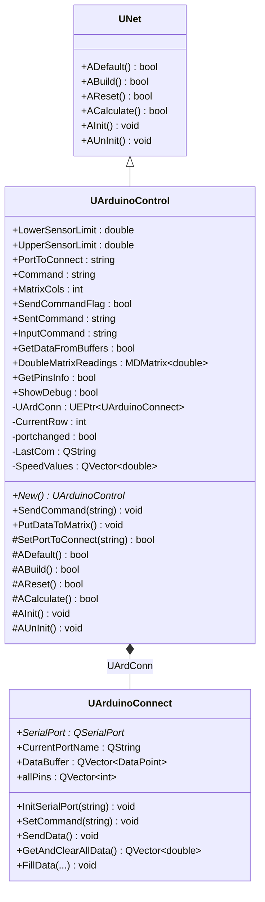
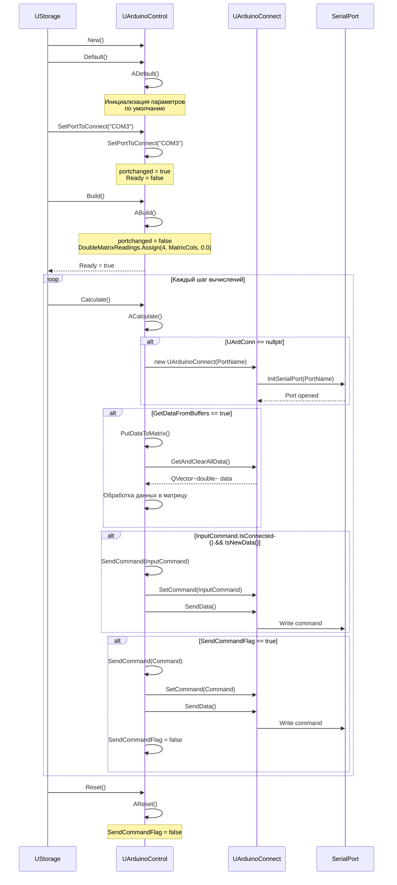
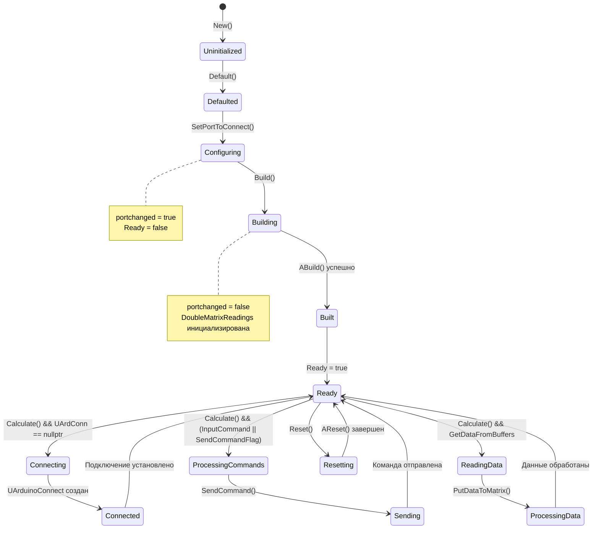
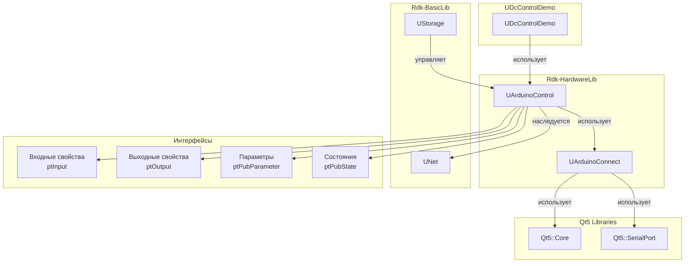
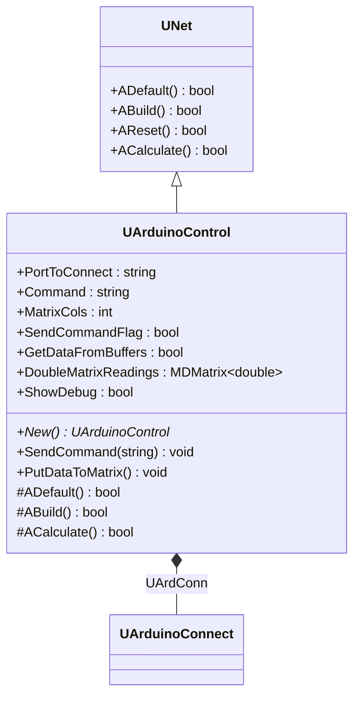
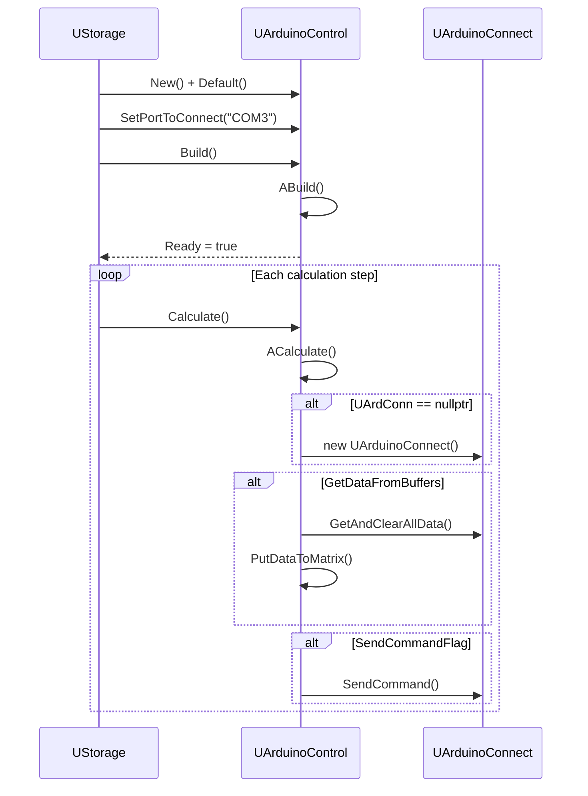
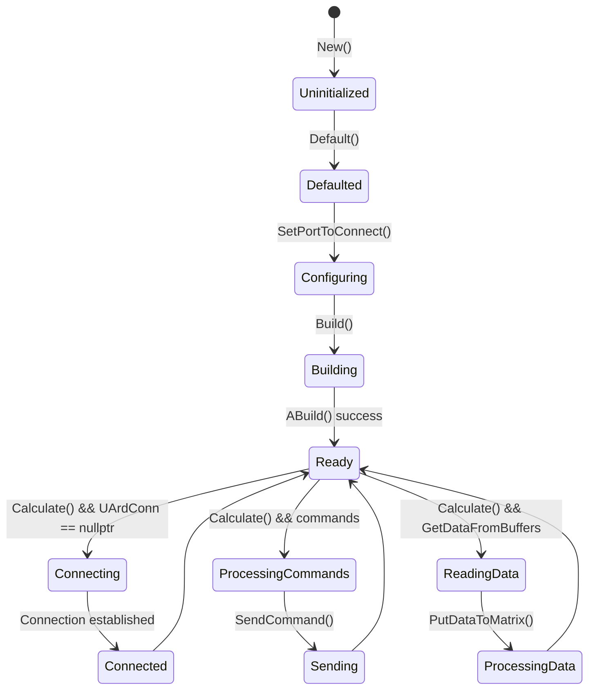
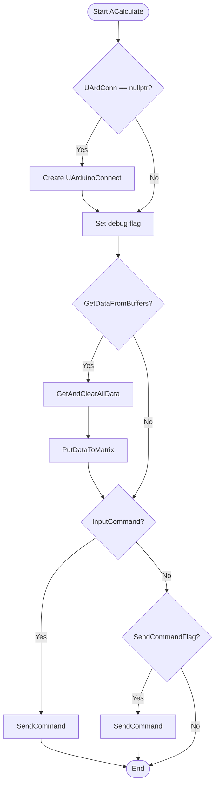
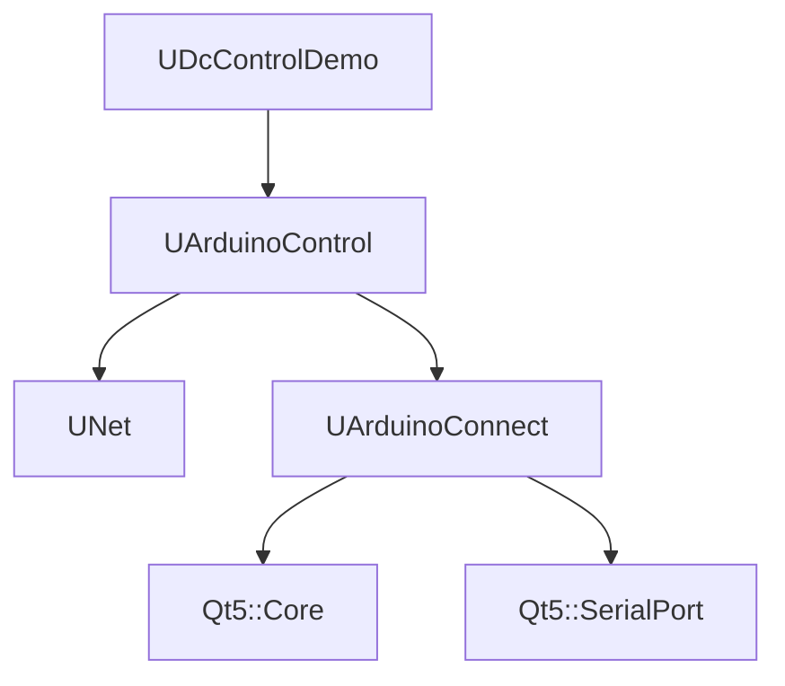

# Arduino — управление подключением к Arduino (Rdk-HardwareLib)

## RU

### Назначение

**Класс**: `UArduinoControl` — компонент управления подключением к плате Arduino через последовательный порт.  
**Регистрация**: `UHardwareLibrary.cpp` → `UploadClass("Arduino", ...)`.  
**Storage-инстансы**: `ClassName = "Arduino"` в `Bin/Configs/*/Model_*.xml`.

`UArduinoControl` расширяет `UNet` функциональностью управления подключением к Arduino. Позволяет отправлять команды на Arduino, получать данные с датчиков, управлять пинами и обрабатывать данные через буферы. Использует `UArduinoConnect` для работы с последовательным портом.

### UML-диаграмма классов



**Иерархия наследования:**
- `UNet` — базовый класс сетевого компонента из Rdk-BasicLib
- `UArduinoControl` — компонент управления Arduino

**Связи с другими компонентами:**
- `UArduinoControl` использует `UArduinoConnect` (композиция через `UEPtr`) для работы с последовательным портом
- `UDcControlDemo` использует `UArduinoControl` для отправки команд на Arduino

### UML-диаграмма последовательности



**Жизненный цикл:**
1. **Создание** — компонент создается через конструктор
2. **Инициализация** — установка параметров по умолчанию через `ADefault()`
3. **Настройка** — установка порта подключения через `SetPortToConnect()`
4. **Сборка** — инициализация матрицы данных через `ABuild()`
5. **Вычисления** — в каждом шаге:
   - Проверка и создание подключения к Arduino
   - Обработка команд (из `InputCommand` или `Command`)
   - Чтение данных из буфера (если `GetDataFromBuffers == true`)
6. **Сброс** — сброс флагов через `AReset()`

### UML-диаграмма состояний



**Состояния:**
- **Uninitialized** — создан, но не инициализирован
- **Defaulted** — параметры установлены по умолчанию
- **Configuring** — настройка параметров (порт подключения)
- **Building** — выполняется сборка структуры
- **Built** — структура построена, матрица данных инициализирована
- **Ready** — готов к выполнению расчетов
- **Connecting** — создается подключение к Arduino
- **Connected** — подключение к Arduino установлено
- **ProcessingCommands** — обработка команд для отправки
- **Sending** — отправка команды на Arduino
- **ReadingData** — чтение данных из буфера
- **ProcessingData** — обработка данных в матрицу
- **Resetting** — выполняется сброс состояний

### UML-диаграмма активности

```mermaid
flowchart TD
    Start([Start ACalculate]) --> CheckConnection{UArdConn == nullptr?}
    CheckConnection -->|Да| CreateConnection[Создать UArduinoConnect]
    CreateConnection --> InitPort[InitSerialPort PortName]
    InitPort --> SetDebug[UArdConn->deb = ShowDebug]
    CheckConnection -->|Нет| SetDebug
    SetDebug --> CheckGetData{GetDataFromBuffers?}
    CheckGetData -->|Да| GetData[GetAndClearAllData]
    GetData --> ProcessData[PutDataToMatrix]
    ProcessData --> ParseBuffer[Парсинг буфера данных]
    ParseBuffer --> ExtractTimestamp[Извлечение timestamp]
    ExtractTimestamp --> ExtractParamCount[Извлечение paramCount]
    ExtractParamCount --> ValidateParams{paramCount валиден?}
    ValidateParams -->|Нет| CheckInputCommand
    ValidateParams -->|Да| ResizeMatrix{Нужно изменить размер матрицы?}
    ResizeMatrix -->|Да| Resize[DoubleMatrixReadings.Assign]
    Resize --> WriteData[Запись данных в матрицу]
    ResizeMatrix -->|Нет| WriteData
    WriteData --> IncrementRow[CurrentRow++]
    IncrementRow --> CheckInputCommand{InputCommand.IsConnected && IsNewData?}
    CheckGetData -->|Нет| CheckInputCommand
    CheckInputCommand -->|Да| SendInputCmd[SendCommand InputCommand]
    SendInputCmd --> SetSentCmd1[SentCommand = InputCommand]
    SetSentCmd1 --> CheckSendFlag
    CheckInputCommand -->|Нет| CheckSendFlag{SendCommandFlag?}
    CheckSendFlag -->|Да| SendCmd[SendCommand Command]
    SendCmd --> SetSentCmd2[SentCommand = Command]
    SetSentCmd2 --> ClearFlag[SendCommandFlag = false]
    CheckSendFlag -->|Нет| End
    ClearFlag --> End([End])
    End
```



**Алгоритм работы ACalculate():**
1. Проверка наличия подключения к Arduino, создание при необходимости
2. Установка флага отладки
3. Если `GetDataFromBuffers == true`: чтение и обработка данных из буфера в матрицу
4. Если `InputCommand` подключен и содержит новые данные: отправка команды
5. Если `SendCommandFlag == true`: отправка команды из `Command` и сброс флага

**Алгоритм работы PutDataToMatrix():**
1. Получение всех данных из буфера `UArduinoConnect`
2. Парсинг данных: извлечение timestamp и количества параметров
3. Валидация данных (проверка на ошибки, корректность количества параметров)
4. Изменение размера матрицы при необходимости
5. Запись данных в матрицу с циклическим перезаписыванием строк

### UML-диаграмма компонентов



**Зависимости:**
- **Rdk-BasicLib** — базовые классы (`UNet`, `UStorage`, `UProperty`)
- **Qt5::Core** — базовые классы Qt (используется в `UArduinoConnect`)
- **Qt5::SerialPort** — работа с последовательными портами (используется в `UArduinoConnect`)

**Интерфейсы:**
- **Входы** — свойства с флагом `ptInput`: `Command`, `InputCommand`
- **Выходы** — свойства с флагом `ptOutput`: отсутствуют (данные доступны через `DoubleMatrixReadings`)
- **Параметры** — свойства с флагом `ptPubParameter`: `LowerSensorLimit`, `UpperSensorLimit`, `PortToConnect`, `Command`, `MatrixCols`
- **Состояния** — свойства с флагом `ptPubState`: `SendCommandFlag`, `SentCommand`, `InputCommand`, `GetDataFromBuffers`, `DoubleMatrixReadings`, `GetPinsInfo`, `ShowDebug`

### Свойства

#### Параметры (ptPubParameter)

- **`LowerSensorLimit`** (double) — нижний предел значений датчика. Используется для калибровки и проверки диапазона значений. Значение по умолчанию: не установлено.

- **`UpperSensorLimit`** (double) — верхний предел значений датчика. Используется для калибровки и проверки диапазона значений. Значение по умолчанию: не установлено.

- **`PortToConnect`** (string) — имя COM-порта для подключения к Arduino (например, "COM3" на Windows, "/dev/ttyUSB0" на Linux). При изменении вызывает `SetPortToConnect()`, который сбрасывает подключение и устанавливает `Ready = false`. Значение по умолчанию: не установлено.

- **`Command`** (string, ptPubParameter | ptInput) — команда для отправки на Arduino. Может быть установлена как параметр или получена через входное соединение. Отправляется при установке `SendCommandFlag = true`. Значение по умолчанию: пустая строка.

- **`MatrixCols`** (int) — количество строк в матрице `DoubleMatrixReadings`. Используется при инициализации матрицы в `ABuild()`. Значение по умолчанию: не установлено.

#### Состояния (ptPubState)

- **`SendCommandFlag`** (bool) — флаг для отправки команды из свойства `Command`. При установке в `true` в `ACalculate()` команда отправляется на Arduino, после чего флаг сбрасывается в `false`. Сбрасывается в `false` при вызове `AReset()`. Значение по умолчанию: `false`.

- **`SentCommand`** (string) — последняя отправленная команда. Обновляется после успешной отправки команды (из `InputCommand` или `Command`). Значение по умолчанию: пустая строка.

- **`InputCommand`** (string, ptPubState | ptInput) — команда, получаемая через входное соединение. Если подключена и содержит новые данные, отправляется автоматически в `ACalculate()`. Может быть установлена вручную (например, из `UDcControlDemo`). Значение по умолчанию: пустая строка.

- **`GetDataFromBuffers`** (bool) — флаг для чтения данных из буфера `UArduinoConnect`. При установке в `true` в `ACalculate()` вызывается `PutDataToMatrix()` для обработки данных. Значение по умолчанию: `false`.

- **`DoubleMatrixReadings`** (MDMatrix<double>) — матрица для хранения данных, полученных с Arduino. Инициализируется в `ABuild()` с размером `MatrixCols` строк и динамическим количеством столбцов (зависит от количества параметров в данных). Структура данных: `[timestamp, param1, param2, ...]`. Значение по умолчанию: пустая матрица.

- **`GetPinsInfo`** (bool) — флаг для получения информации о конфигурации пинов Arduino. Значение по умолчанию: `false`.

- **`ShowDebug`** (bool) — флаг для вывода отладочной информации в консоль. Передается в `UArduinoConnect->deb` для управления выводом отладочных сообщений. Значение по умолчанию: `false`.

#### Защищенные поля

- **`UArdConn`** (UEPtr<UArduinoConnect>) — указатель на объект подключения к Arduino. Создается автоматически в `ACalculate()` при первом вызове, если равен `nullptr`. Освобождается в `AUnInit()`.

- **`CurrentRow`** (int) — текущая строка в матрице `DoubleMatrixReadings` для записи данных. Инкрементируется после каждой записи, сбрасывается в 0 при достижении `MatrixCols`.

- **`portchanged`** (bool) — флаг изменения порта подключения. Устанавливается в `true` при изменении `PortToConnect`, сбрасывается в `false` в `ABuild()`.

- **`LastCom`** (QString) — последнее имя COM-порта.

- **`SpeedValues`** (QVector<double>) — вектор значений скорости, получаемых с Arduino. Используется компонентом `UDcControlDemo` для получения скорости двигателя.

### Методы

#### Публичные методы

- **`New()`** → `UArduinoControl*` — создает новый экземпляр класса. Используется системой `UStorage` для создания компонентов.

- **`SendCommand(string command)`** → `void` — отправляет команду на Arduino через `UArduinoConnect`. Устанавливает команду в `UArduinoConnect` и вызывает `SendData()` для отправки. Параметры:
  - `command` (string) — команда для отправки

- **`PutDataToMatrix()`** → `void` — обрабатывает данные из буфера `UArduinoConnect` и записывает их в матрицу `DoubleMatrixReadings`. Парсит данные в формате `[timestamp, paramCount, param1, param2, ...]`, валидирует их и записывает в матрицу с циклическим перезаписыванием строк.

#### Защищенные методы жизненного цикла

- **`ADefault()`** → `bool` — инициализирует параметры по умолчанию. В текущей реализации всегда возвращает `true`. Вызывается автоматически при `Default()`.

- **`ABuild()`** → `bool` — строит внутреннюю структуру компонента. Инициализирует матрицу `DoubleMatrixReadings` с размером `MatrixCols` строк и 4 столбца, сбрасывает флаг `portchanged`. Вызывается автоматически при `Build()`. Возвращает `true` при успешной сборке.

- **`AReset()`** → `bool` — сбрасывает состояние компонента. Сбрасывает `SendCommandFlag` в `false`. Вызывается автоматически при `Reset()`. Возвращает `true`.

- **`ACalculate()`** → `bool` — выполняет расчет компонента на каждом шаге. Проверяет и создает подключение к Arduino при необходимости, обрабатывает команды и данные из буфера. Вызывается автоматически при `Calculate()`. Возвращает `true`.

#### Защищенные методы инициализации

- **`AInit()`** → `void` — инициализация компонента. В текущей реализации пустой. Вызывается автоматически при `Init()`.

- **`AUnInit()`** → `void` — деинициализация компонента. Освобождает память, занятую `UArdConn`, и обнуляет указатель. Вызывается автоматически при `UnInit()`.

#### Защищенные методы установки параметров

- **`SetPortToConnect(const string& value)`** → `bool` — устанавливает порт подключения. Вызывает `UnInit()` для закрытия текущего подключения, устанавливает `Ready = false` и `portchanged = true`. Вызывается автоматически при изменении свойства `PortToConnect`. Параметры:
  - `value` (const string&) — имя COM-порта

- **`ResetPortChanged()`** → `void` — сбрасывает флаг изменения порта. В текущей реализации не используется.

### Примеры использования в C++

#### Пример 1: Создание и настройка компонента

```cpp
// Создание компонента управления Arduino
auto arduinoControl = storage->CreateComponent<UArduinoControl>();
arduinoControl->SetName("ArduinoControl1");

// Инициализация
arduinoControl->Default();

// Настройка параметров
arduinoControl->PortToConnect = "COM3";
arduinoControl->MatrixCols = 100;
arduinoControl->ShowDebug = true;
arduinoControl->LowerSensorLimit = 0.0;
arduinoControl->UpperSensorLimit = 1023.0;

// Сборка
arduinoControl->Build();

// Использование
for (int step = 0; step < 1000; step++) {
    // Установка команды для отправки
    arduinoControl->Command = "READ_SENSORS";
    arduinoControl->SendCommandFlag = true;
    
    // Чтение данных из буфера
    arduinoControl->GetDataFromBuffers = true;
    
    // Выполнение расчета
    arduinoControl->Calculate();
    
    // Получение данных из матрицы
    if (arduinoControl->DoubleMatrixReadings->GetRows() > 0) {
        double timestamp = arduinoControl->DoubleMatrixReadings(0, 0);
        double sensorValue = arduinoControl->DoubleMatrixReadings(0, 1);
        std::cout << "Step " << step << ": Time=" << timestamp 
                  << ", Value=" << sensorValue << std::endl;
    }
}
```

#### Пример 2: Использование входного соединения

```cpp
// Создание компонента-источника команды
auto commandSource = storage->CreateComponent<UScalarSource>();
commandSource->SetName("CommandSource");

// Создание компонента управления Arduino
auto arduinoControl = storage->CreateComponent<UArduinoControl>();
arduinoControl->SetName("ArduinoControl1");
arduinoControl->PortToConnect = "COM3";
arduinoControl->Build();

// Создание связи
storage->CreateLink(commandSource->Output, arduinoControl->InputCommand);

// В цикле расчетов команды будут автоматически передаваться
// из CommandSource в ArduinoControl через InputCommand
```

#### Пример 3: Обработка данных из буфера

```cpp
auto arduinoControl = storage->CreateComponent<UArduinoControl>();
arduinoControl->SetName("ArduinoControl1");
arduinoControl->PortToConnect = "COM3";
arduinoControl->MatrixCols = 50;
arduinoControl->GetDataFromBuffers = true;
arduinoControl->Build();

// В цикле расчетов
arduinoControl->Calculate();

// Получение всех данных из матрицы
auto& matrix = arduinoControl->DoubleMatrixReadings;
for (int row = 0; row < matrix->GetRows(); row++) {
    double timestamp = matrix(row, 0);
    int paramCount = static_cast<int>(matrix(row, 1));
    
    std::cout << "Row " << row << ": Time=" << timestamp 
              << ", Params=" << paramCount;
    
    for (int col = 2; col < matrix->GetCols(); col++) {
        std::cout << ", " << matrix(row, col);
    }
    std::cout << std::endl;
}
```

### Примеры конфигурации XML

#### Пример 1: Базовая конфигурация

```xml
<Model Class="NModel">
    <Components>
        <ArduinoControl1 Class="Arduino">
            <Parameters>
                <PortToConnect>COM3</PortToConnect>
                <MatrixCols>100</MatrixCols>
                <LowerSensorLimit>0.0</LowerSensorLimit>
                <UpperSensorLimit>1023.0</UpperSensorLimit>
                <ShowDebug>true</ShowDebug>
            </Parameters>
        </ArduinoControl1>
    </Components>
</Model>
```

#### Пример 2: Конфигурация с входным соединением

```xml
<Model Class="NModel">
    <Components>
        <CommandSource Class="UScalarSource">
            <Parameters>
                <Value>"READ_SENSORS"</Value>
            </Parameters>
        </CommandSource>
        
        <ArduinoControl1 Class="Arduino">
            <Parameters>
                <PortToConnect>COM3</PortToConnect>
                <MatrixCols>50</MatrixCols>
                <GetDataFromBuffers>true</GetDataFromBuffers>
            </Parameters>
        </ArduinoControl1>
    </Components>
    
    <Links>
        <elem>
            <Item>CommandSource.Output</Item>
            <Connector>ArduinoControl1.InputCommand</Connector>
        </elem>
    </Links>
</Model>
```

#### Пример 3: Конфигурация с отправкой команд

```xml
<Model Class="NModel">
    <Components>
        <ArduinoControl1 Class="Arduino">
            <Parameters>
                <PortToConnect>/dev/ttyUSB0</PortToConnect>
                <MatrixCols>200</MatrixCols>
                <Command>"SET_SPEED 50"</Command>
                <SendCommandFlag>true</SendCommandFlag>
            </Parameters>
        </ArduinoControl1>
    </Components>
</Model>
```

### Использование в конфигурациях

`UArduinoControl` используется как базовый компонент для работы с Arduino в конфигурационных проектах. Типичные сценарии использования:

1. **Управление датчиками** — чтение данных с аналоговых и цифровых датчиков через `GetDataFromBuffers` и `DoubleMatrixReadings`
2. **Управление исполнительными устройствами** — отправка команд через `Command` или `InputCommand` для управления моторами, сервоприводами и т.д.
3. **Интеграция с другими компонентами** — использование `InputCommand` для получения команд от других компонентов (например, `UDcControlDemo`)

**Типичные значения параметров:**
- **PortToConnect**: "COM3", "COM4" (Windows), "/dev/ttyUSB0", "/dev/ttyACM0" (Linux)
- **MatrixCols**: 50-200 (зависит от объема данных)
- **ShowDebug**: `true` для отладки, `false` для production

### См. также

- [`UArduinoConnect`](../Architecture.md) — класс подключения к последовательному порту
- [`UDcControlDemo`](DC.md) — компонент управления DC-двигателем
- [`ADC`](ADC.md) — компонент для работы с аналоговыми датчиками
- [Architecture.md](../Architecture.md) — архитектура библиотеки

---

## EN

### Purpose

**Class**: `UArduinoControl` — component for managing connection to Arduino board via serial port.  
**Registration**: `UHardwareLibrary.cpp` → `UploadClass("Arduino", ...)`.  
**Instances**: `ClassName = "Arduino"` in `Bin/Configs/*/Model_*.xml`.

`UArduinoControl` extends `UNet` with Arduino connection management functionality. Allows sending commands to Arduino, receiving sensor data, managing pins, and processing data through buffers. Uses `UArduinoConnect` for serial port communication.

### UML Class Diagram



### UML Sequence Diagram



### UML State Diagram



### UML Activity Diagram



### UML Component Diagram



### Properties

#### Parameters (ptPubParameter)

- **`PortToConnect`** (string) — COM port name for Arduino connection (e.g., "COM3" on Windows, "/dev/ttyUSB0" on Linux)
- **`Command`** (string, ptPubParameter | ptInput) — command to send to Arduino
- **`MatrixCols`** (int) — number of rows in `DoubleMatrixReadings` matrix
- **`LowerSensorLimit`** (double) — lower limit for sensor values
- **`UpperSensorLimit`** (double) — upper limit for sensor values

#### States (ptPubState)

- **`SendCommandFlag`** (bool) — flag to send command from `Command` property
- **`SentCommand`** (string) — last sent command
- **`InputCommand`** (string, ptPubState | ptInput) — command received via input connection
- **`GetDataFromBuffers`** (bool) — flag to read data from buffer
- **`DoubleMatrixReadings`** (MDMatrix<double>) — matrix for storing data from Arduino
- **`ShowDebug`** (bool) — flag for debug output

### Methods

#### Public Methods

- **`New()`** → `UArduinoControl*` — creates new instance
- **`SendCommand(string command)`** → `void` — sends command to Arduino
- **`PutDataToMatrix()`** → `void` — processes data from buffer into matrix

#### Protected Lifecycle Methods

- **`ADefault()`** → `bool` — initializes default parameters
- **`ABuild()`** → `bool` — builds internal structure
- **`AReset()`** → `bool` — resets component state
- **`ACalculate()`** → `bool` — performs calculation step

### Usage Examples in C++

```cpp
auto arduinoControl = storage->CreateComponent<UArduinoControl>();
arduinoControl->PortToConnect = "COM3";
arduinoControl->MatrixCols = 100;
arduinoControl->Build();

arduinoControl->Command = "READ_SENSORS";
arduinoControl->SendCommandFlag = true;
arduinoControl->GetDataFromBuffers = true;
arduinoControl->Calculate();
```

### XML Configuration Examples

```xml
<ArduinoControl1 Class="Arduino">
    <Parameters>
        <PortToConnect>COM3</PortToConnect>
        <MatrixCols>100</MatrixCols>
        <ShowDebug>true</ShowDebug>
    </Parameters>
</ArduinoControl1>
```
