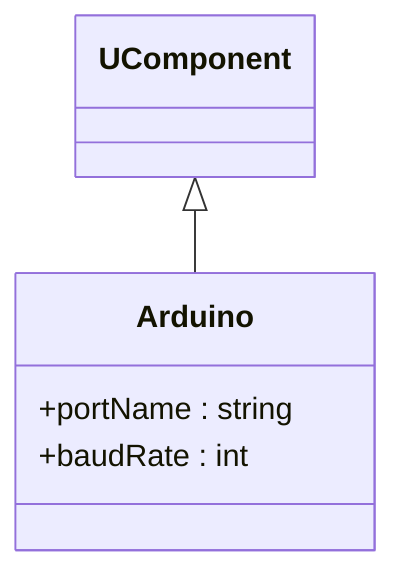

## Arduino — подключение платы (Rdk-HardwareLib)

**Класс**: `Arduino` — компонент, инкапсулирующий соединение с платой Arduino по Serial.  
**Storage-компонент**: регистрируется в `UHardwareLibrary.cpp` через `UploadClass("Arduino", ...)`.

### Входы/выходы
- Вход: параметры порта (имя, скорость).
- Выход: внутренний канал связи, используемый компонентами `ADC`, `DC`.

---

## Arduino — board connection (Rdk-HardwareLib)

Base serial-connection component for Arduino-based sensors/actuators.

