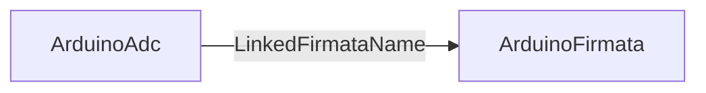

# ArduinoAdc

## RU

## Назначение

**ClassName:** `ArduinoAdc`  
**C++:** `UArduinoAdc` : `UNet` (база **не** меняется)  
**Роль:** Чтение ADC через связанный `ArduinoFirmata` (свой serial не открывает).

## Ключевые свойства

| Свойство | Роль |
|----------|------|
| `LinkedFirmataName` | Имя узла `ArduinoFirmata` на canvas |
| `AnalogPin` | Номер пина Firmata |
| `ReadAdcFlag` | **Edge:** запросить чтение |
| `AdcValue` | State: 0–1023 |
| `AdcReadOk` | State: firmata найден и `IsLinkReady` |

`firmata->Calculate()` вызывается **только** из `UArduinoAdc::ACalculate` (поток движка).

## Типичная схема

## GUI

`hw.arduino.adc` — `LinkedFirmataName`, analog pin, `pulseEdge("ReadAdcFlag")`.

## Тестовый конфиг

`Bin/Configs/SpikeSamples/Hardware/04-ArduinoAdc/`

## ClDesc

`Bin/ClDesc/HardwareLibrary/ru-RU/ArduinoAdc.xml`

---

## EN

## Purpose

**ClassName:** `ArduinoAdc`  
**C++:** `UArduinoAdc` : `UNet` (base **unchanged**)  
**Role:** ADC reading via linked `ArduinoFirmata` (does not open its own serial).

## Key properties

| Property | Role |
|----------|------|
| `LinkedFirmataName` | Name of `ArduinoFirmata` node on canvas |
| `AnalogPin` | Firmata pin number |
| `ReadAdcFlag` | **Edge:** request read |
| `AdcValue` | State: 0–1023 |
| `AdcReadOk` | State: firmata found and `IsLinkReady` |

`firmata->Calculate()` is called **only** from `UArduinoAdc::ACalculate` (engine thread).

## Typical layout

## GUI

`hw.arduino.adc` — `LinkedFirmataName`, analog pin, `pulseEdge("ReadAdcFlag")`.

## Test config

`Bin/Configs/SpikeSamples/Hardware/04-ArduinoAdc/`

## ClDesc

`Bin/ClDesc/HardwareLibrary/ru-RU/ArduinoAdc.xml`
