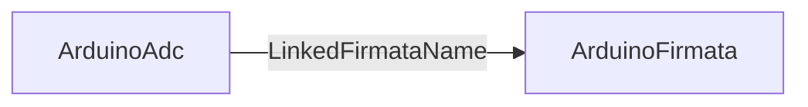

# ArduinoAdc

## Назначение

**ClassName:** `ArduinoAdc`  
**C++:** `UArduinoAdc` : `UNet`  
**Роль:** Чтение аналогового значения через **уже подключённый** `ArduinoFirmata` (отдельный serial не открывает).

## Ключевые свойства

| Свойство | Описание |
|----------|----------|
| `LinkedFirmataName` | Имя узла `ArduinoFirmata` на canvas (не ClassName) |
| `AnalogPin` | Номер аналогового пина |
| `ReadAdcFlag` | Edge: запросить чтение в `ACalculate` |
| `AdcValue` | Результат 0–1023 |

## Типичная схема

Требования: Firmata подключён (`FirmataReady`), порт и baud настроены на узле Firmata.

## GUI

Отдельной формы нет — свойства через property grid NeuroModeler.

## Тестовый конфиг

`Bin/Configs/SpikeSamples/Hardware/04-ArduinoAdc/`

## ClDesc

`Bin/ClDesc/HardwareLibrary/ru-RU/ArduinoAdc.xml`

## Миграция

Старый `ADC` / `UADC` → `ArduinoAdc`. См. [Legacy/README.md](../Legacy/README.md).
