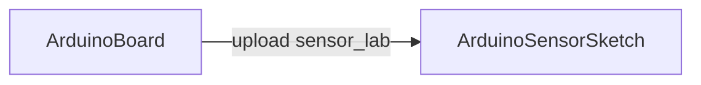

# ArduinoBoard

## RU

## Назначение

**ClassName:** `ArduinoBoard`  
**C++:** `UArduinoBoard`  
**Роль:** USB serial, прошивка bundled/custom HEX (avrdude), heartbeat, auto-reconnect.

## Ключевые свойства

| Свойство | Описание |
|----------|----------|
| `PortName` | Путь порта (`/dev/ttyACM0`, `COM3`) |
| `BaudRate` | По умолчанию **57600** |
| `BoardProfile` | 0 = Uno, 1 = Mega 2560 |
| `ConnectOnBuild` | Подключение в `ABuild` |
| `BundledFirmwareId` | `sensor_lab_v1`, `standard_firmata` |
| `FirmwarePath` | Альтернатива manifest — свой `.hex` |
| `Connect` / `Disconnect` / `Reconnect` | Edge: управление serial (сброс в `false` после тика) |
| `UploadFirmware` | Edge: прошивка (legacy: `UploadFirmwareFlag`) |
| `ClearLastError` | Edge |
| `IsConnected` / `HasError` / `IsDisconnected` | State для GUI/схемы |
| `ConnectionState` | 0–3 (см. [API-Overview.md](../API-Overview.md)) |
| `LastError` | Текст ошибки serial/upload |

## Примеры конфигураций (Bin/SpikeSamples)

- [Hardware/01-ArduinoBoard](../../../../Bin/Configs/SpikeSamples/Hardware/01-ArduinoBoard/README.md)
- Обзор темы: [Bin/Docs/SpikeSamples/Overview.md](../../../../Bin/Docs/SpikeSamples/Overview.md)

## Типичная схема

Часто Board используют только для upload; данные читает отдельный `ArduinoSensorSketch` с тем же портом.

## GUI

- **Form id:** `hw.arduino.board`
- **Widget:** `HardwareArduinoBoardControllerWidget`
- Порт (сортировка USB/serial), Board profile, upload, connect/disconnect, diagram Uno/Mega

## Тестовый конфиг

`Bin/Configs/SpikeSamples/Hardware/01-ArduinoBoard/`

## ClDesc

`Bin/ClDesc/HardwareLibrary/ru-RU/ArduinoBoard.xml`

## См. также

- [Transport.md](../Transport.md) — `UArduinoFlasher`, `UArduinoSerialSession`
- [firmware_build.md](../firmware_build.md)

---

### Ключевые свойства / Favorites

| Свойство | Роль |
|----------|------|
| `PortName` / `BaudRate` / `BoardProfile` | Serial и профиль платы |
| `ConnectOnBuild` / `Connect` / `Disconnect` / `Reconnect` | Подключение |
| `UploadFirmware` / `BundledFirmwareId` | Прошивка |
| `IsConnected` / `HasError` / `LastError` | Состояние |

ClDesc: `Bin/ClDesc/HardwareLibrary/ru-RU/ArduinoBoard.xml` (Properties выровнены с runtime).

## EN

## Purpose

**ClassName:** `ArduinoBoard`  
**C++:** `UArduinoBoard`  
**Role:** USB serial, bundled/custom HEX flashing (avrdude), heartbeat, auto-reconnect.

## Key properties

| Property | Description |
|----------|-------------|
| `PortName` | Port path (`/dev/ttyACM0`, `COM3`) |
| `BaudRate` | Default **57600** |
| `BoardProfile` | 0 = Uno, 1 = Mega 2560 |
| `ConnectOnBuild` | Connect in `ABuild` |
| `BundledFirmwareId` | `sensor_lab_v1`, `standard_firmata` |
| `FirmwarePath` | Manifest alternative — custom `.hex` |
| `Connect` / `Disconnect` / `Reconnect` | Edge: serial control (reset to `false` after tick) |
| `UploadFirmware` | Edge: flash firmware (legacy: `UploadFirmwareFlag`) |
| `ClearLastError` | Edge |
| `IsConnected` / `HasError` / `IsDisconnected` | State for GUI/schematic |
| `ConnectionState` | 0–3 (see [API-Overview.md](../API-Overview.md)) |
| `LastError` | Serial/upload error text |

## Example configurations (Bin/SpikeSamples)

- [Hardware/01-ArduinoBoard](../../../../Bin/Configs/SpikeSamples/Hardware/01-ArduinoBoard/README.md)
- Topic overview: [Bin/Docs/SpikeSamples/Overview.md](../../../../Bin/Docs/SpikeSamples/Overview.md)

## Typical layout

Board is often used only for upload; data is read by a separate `ArduinoSensorSketch` on the same port.

## GUI

- **Form id:** `hw.arduino.board`
- **Widget:** `HardwareArduinoBoardControllerWidget`
- Port (USB/serial sort), Board profile, upload, connect/disconnect, Uno/Mega diagram

## Test config

`Bin/Configs/SpikeSamples/Hardware/01-ArduinoBoard/`

## ClDesc

`Bin/ClDesc/HardwareLibrary/ru-RU/ArduinoBoard.xml`

## See also

- [Transport.md](../Transport.md) — `UArduinoFlasher`, `UArduinoSerialSession`
- [firmware_build.md](../firmware_build.md)
