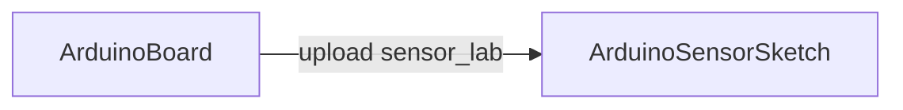

# ArduinoBoard

## Назначение

**ClassName:** `ArduinoBoard`  
**C++:** `UArduinoBoard`  
**Роль:** USB serial, прошивка bundled/custom HEX (avrdude), heartbeat, auto-reconnect.

## Ключевые свойства

| Свойство | Описание |
|----------|----------|
| `PortName` | Путь порта (`/dev/ttyACM0`, `COM3`) |
| `BaudRate` | По умолчанию **57600** |
| `BoardProfile` | 0 = Uno, 1 = Mega 2560 |
| `ConnectOnBuild` | Подключение в `ABuild` |
| `BundledFirmwareId` | `sensor_lab_v1`, `standard_firmata` |
| `FirmwarePath` | Альтернатива manifest — свой `.hex` |
| `UploadFirmwareFlag` | Edge: запуск прошивки в `ACalculate` |
| `ConnectionState` | 0–3 (см. [API-Overview.md](../API-Overview.md)) |
| `LastError` | Текст ошибки serial/upload |

## Типичная схема

Часто Board используют только для upload; данные читает отдельный `ArduinoSensorSketch` с тем же портом.

## GUI

- **Form id:** `hw.arduino.board`
- **Widget:** `HardwareArduinoBoardControllerWidget`
- Порт (сортировка USB/serial), Board profile, upload, connect/disconnect, diagram Uno/Mega

## Тестовый конфиг

`Bin/Configs/SpikeSamples/Hardware/01-ArduinoBoard/`

## ClDesc

`Bin/ClDesc/HardwareLibrary/ru-RU/ArduinoBoard.xml`

## См. также

- [Transport.md](../Transport.md) — `UArduinoFlasher`, `UArduinoSerialSession`
- [firmware_build.md](../firmware_build.md)
