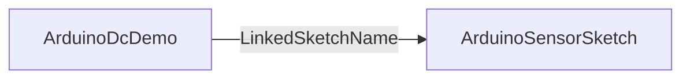

# ArduinoDcDemo

## Назначение

**ClassName:** `ArduinoDcDemo`  
**C++:** `UArduinoDcDemo` : `UNet`  
**Роль:** Демо DC-мотора — отправка команд и чтение скорости через связанный `ArduinoSensorSketch`.

## Ключевые свойства

| Свойство | Описание |
|----------|----------|
| `LinkedSketchName` | Имя узла `ArduinoSensorSketch` на canvas |
| `Command` | Строка команды (output/parameter) |
| `SendCommandFlag` | Edge: передать `Command` в sketch |
| `SentCommand` | Последняя отправленная команда |
| `Speed` / `Acceleration` | Состояние (из данных sketch при `GetSpeed`) |
| `GetSpeed` | Edge: обновить скорость |

## Типичная схема

Sketch должен быть подключён к плате с прошивкой `sensor_lab_v1`.

## GUI

Отдельной формы нет — property grid.

## Тестовый конфиг

`Bin/Configs/SpikeSamples/Hardware/05-ArduinoDcDemo/`

## ClDesc

`Bin/ClDesc/HardwareLibrary/ru-RU/ArduinoDcDemo.xml`

## Миграция

Старый `DC` / `UDcControlDemo` → `ArduinoDcDemo`. См. [Legacy/README.md](../Legacy/README.md).
