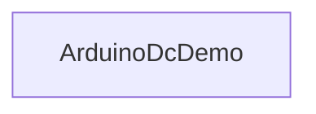

# ArduinoDcDemo

## Назначение

**ClassName:** `ArduinoDcDemo`  
**C++:** `UArduinoDcDemo` : `UArduinoCustomLink` : `UArduinoBoard`  
**Роль:** Демо DC-мотора — serial, прошивка `sensor_lab_v1`, команды и чтение скорости в **одном узле**.

## Ключевые свойства

| Свойство | Роль |
|----------|------|
| `PortName`, `BundledFirmwareId` | Порт и прошивка (как у Board/Sketch) |
| `Connect` / `Disconnect` | Edge подключения (вкладка Board в GUI) |
| `Command` | Строка команды |
| `SendCommand` | Edge: отправить `Command` |
| `GetSpeed` | Edge: запросить скорость |
| `Speed` / `Acceleration` | State (из binary frame `0x01` в `OnBinaryFrame`) |

## Deprecated

`LinkedSketchName` — если не пуст, делегирует команды в `ArduinoSensorSketch` (переходный релиз). **Новые схемы:** один `ArduinoDcDemo` без sketch.

## Типичная схема

Прошивка: `sensor_lab_v1`, `BaudRate` 57600.

## GUI

`hw.arduino.dc_demo` — вкладки **DC** (команды, presets) и **Board** (порт, Connect, upload).

## Тестовый конфиг

`Bin/Configs/SpikeSamples/Hardware/05-ArduinoDcDemo/`

## ClDesc

`Bin/ClDesc/HardwareLibrary/ru-RU/ArduinoDcDemo.xml`

## Миграция

Два узла `SensorSketch` + `DcDemo` → один `DcDemo`: `Scripts/migrate_arduino_board_hierarchy.py` или regen `Scripts/generate_arduino_hardware_configs.py`.
