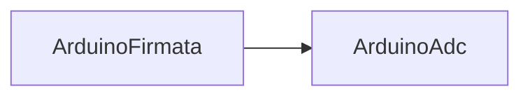

# ArduinoFirmata

## Назначение

**ClassName:** `ArduinoFirmata`  
**C++:** `UArduinoFirmata` : `UArduinoBoard`  
**Роль:** Standard Firmata — digital/analog через `UArduinoFirmataClient`.

## Ключевые свойства

| Свойство | Роль |
|----------|------|
| `BundledFirmwareId` | По умолчанию `standard_firmata` |
| `RestartFirmata` | **Edge:** сброс handshake |
| `ApplyPinConfig` | **Edge:** `RunFirmataActions()` |
| `IsFirmataReady` / `IsLinkReady` | State (link = connected ∧ firmata ready) |
| `FirmataReady` | Legacy state (= `IsFirmataReady`) |
| `SelectedPin` / `SelectedPinMode` | Параметры пина |
| `SetPinModeFlag` / `WriteDigitalFlag` / `ReadAnalogFlag` | Legacy edge |
| `ReportAnalogEnable` | Включить analog report |

## GUI

`hw.arduino.firmata` — вкладки **Firmata** | **Board**, diagram, `pulseEdge("RestartFirmata")`.

## Handshake

После connect: REPORT_FIRMWARE_VERSION → CAPABILITY → ANALOG_MAPPING → `FirmataReady`.

## Типичная схема

## Тестовый конфиг

`Bin/Configs/SpikeSamples/Hardware/03-ArduinoFirmata/`, `04-ArduinoAdc/`

## ClDesc

`Bin/ClDesc/HardwareLibrary/ru-RU/ArduinoFirmata.xml`
