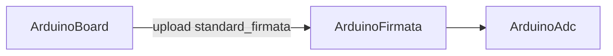

# ArduinoFirmata

## Назначение

**ClassName:** `ArduinoFirmata`  
**C++:** `UArduinoFirmata` : `UArduinoBoard`  
**Роль:** Standard Firmata — digital/analog через in-tree `UArduinoFirmataClient`.

## Ключевые свойства

| Свойство | Описание |
|----------|----------|
| `BundledFirmwareId` | По умолчанию `standard_firmata` |
| `FirmataReady` | Handshake завершён |
| `FirmataFirmwareVersion` | Версия с платы |
| `SelectedPin` | Номер Firmata pin |
| `SelectedPinMode` | INPUT/OUTPUT/ANALOG/PWM |
| `SetPinModeFlag` / `WriteDigitalFlag` / `ReadAnalogFlag` | Edge-действия в `ACalculate` |

## Handshake

После connect: REPORT_FIRMWARE_VERSION → CAPABILITY_QUERY → ANALOG_MAPPING_QUERY → `FirmataReady` = true.

Scope MVP: [firmata_spike.md](../firmata_spike.md).

## Типичная схема

## GUI

- **Form id:** `hw.arduino.firmata`
- Интерактивная diagram: клик по пину → `SelectedPin`

## Тестовый конфиг

`Bin/Configs/SpikeSamples/Hardware/03-ArduinoFirmata/`

## ClDesc

`Bin/ClDesc/HardwareLibrary/ru-RU/ArduinoFirmata.xml`
