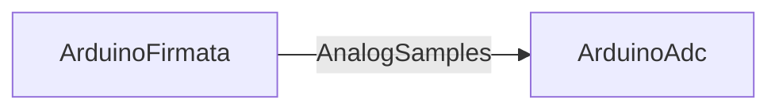

# ArduinoFirmata

## Назначение

**ClassName:** `ArduinoFirmata`  
**C++:** `UArduinoFirmata` : `UArduinoBoard`  
**Роль:** Standard Firmata — digital/analog, векторные выборки, PWM/Servo/I2C (MVP).

## Ключевые свойства

| Свойство | Роль |
|----------|------|
| `BundledFirmwareId` | По умолчанию `standard_firmata` |
| `RestartFirmata` | **Edge:** сброс handshake |
| `ApplyPinConfig` | **Edge:** `RunFirmataActions()` |
| `SetPinMode` / `WriteDigital` / `ReadAnalog` | **Edge:** действия над выбранным пином |
| `SetPinModeFlag` / `WriteDigitalFlag` / `ReadAnalogFlag` | Legacy (читаются вместе с edge) |
| `IsFirmataReady` / `IsLinkReady` / `HandshakeStage` | State |
| `SelectedPin` / `SelectedPinMode` / `DigitalPinValue` | Параметры пина |
| `AnalogPinValue` | Последнее значение канала выбранного пина |
| `PinStatusJson` | JSON состояния всех пинов (для diagram/GUI) |
| `AutoRefreshPins` / `RefreshPins` | Непрерывный/разовый digital+analog report |
| `AnalogSamples` / `DigitalSamples` | `MDMatrix<double>` **output** (timestamp, pin, value…) |
| `DigitalOutputCommands` / `PinConfigBatch` | **Input** матрицы пакетных команд |
| `WritePwm` / `PwmPinValue` / `AnalogOutputCommands` | PWM (sysex 0x6F) |
| `LoadPreset` / `PinConfigPreset` | Пресеты `uno_d13_blink`, `uno_a0_monitor`, … |
| `QueryPinState` / `QueryPin` | PIN_STATE_QUERY |
| `ConfigureServo` / `WriteServo` / `ServoPin` / `ServoAngle` | Servo MVP |
| `I2cWrite` / `I2cRead` / `I2cAddress` / `I2cWriteData` / `I2cReadData` | I2C MVP |
| `StreamLog` / `StreamLogEnable` | Отладочный лог RX (при `ShowDebug`) |

Нумерация TX: **Firmata pin #**; `reportAnalog` — **analog channel** после `ANALOG_MAPPING`.

## GUI

`hw.arduino.firmata` — diagram + вкладки **Pins** (таблица пинов), **Monitor** (`AnalogSamples`, `StreamLog`), **I2C**, **Board**.

Пины: `UArduinoPinMap` (Uno 0–19, Mega 0–69). Диаграмма: `applyPinStatusJson(PinStatusJson)`.

## Handshake

REPORT_FIRMWARE_VERSION → CAPABILITY → ANALOG_MAPPING → `HandshakeStage=4`, sampling 19 ms.

## Watch / схема

Свяжите `AnalogSamples` или `DigitalSamples` с downstream-компонентом (статистика, граф через Watch).

## Типичная схема

`ArduinoAdc.UseLinkedAnalogSamples` (по умолчанию true) читает последнюю строку матрицы по `AnalogPin`.

## Тестовые конфиги

`Bin/Configs/SpikeSamples/Hardware/03-ArduinoFirmata/`, `04-ArduinoAdc/`, `08-ArduinoFirmata-AnalogLink/` (если добавлен)

## ClDesc

`Bin/ClDesc/HardwareLibrary/ru-RU/ArduinoFirmata.xml`

## Техдолг

См. [FirmataTechDebt.md](../FirmataTechDebt.md).
