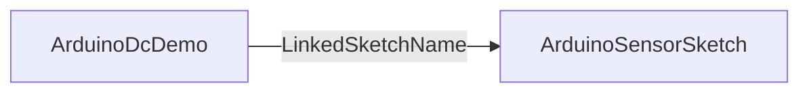

# ArduinoSensorSketch

## Назначение

**ClassName:** `ArduinoSensorSketch`  
**C++:** `UArduinoSensorSketch` : `UArduinoCustomLink` : `UArduinoBoard`  
**Роль:** Прошивка `sensor_lab` — текстовые команды + бинарные кадры (DHT, Hall, Servo).

## Ключевые свойства

Наследует все свойства `ArduinoBoard` и `UArduinoCustomLink`.

| Свойство | Описание |
|----------|----------|
| `Command` / `SendCommandFlag` | Отправка строковой команды |
| `InputCommand` | Команда по связи от другого узла |
| `ProtocolVersion` | 1 = legacy, 2 = CRC frames |
| `GetDataFromBuffers` | Запись RX `0x01` в `DoubleMatrixReadings` |
| `GetPinsInfo` | Edge → `GET STATUS`, парсинг `0x04` → `PinStatusJson` |
| `LowerSensorLimit` / `UpperSensorLimit` | Ограничение значений в матрице |
| `MatrixCols` | Ширина матрицы |

## Команды (пресеты GUI)

- `START READING` / `STOP READING`
- `ROTATE` / `STOP ROTATE`
- `GET STATUS` / `GET PINS INFO`

Подробнее: [Protocol.md](../Protocol.md).

## Пины по умолчанию (manifest)

D2 — DHT, A2 — Hall, D9 — Servo (`Firmware/manifest.json`).

## Типичная схема

## GUI

- **Form id:** `hw.arduino.sensor_sketch`
- Diagram с ролями пинов, matrix preview, presets

## Тестовые конфиги

- `02-ArduinoSensorSketch/`
- `06-ArduinoSensorSketch-Proto2/` (ProtocolVersion 2)

## ClDesc

`Bin/ClDesc/HardwareLibrary/ru-RU/ArduinoSensorSketch.xml`
