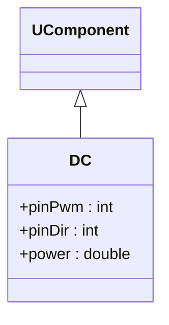
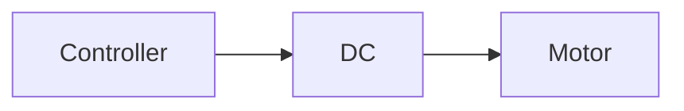

## DC — управление DC-двигателем (Rdk-HardwareLib)

**Класс**: `DC` — компонент управления DC-мотором через Arduino (PWM/направление).  
**Storage-компонент**: `UploadClass("DC", ...)`.

### Входы/выходы
- Вход: требуемый уровень мощности/скорости.
- Выход: сигналы на пины Arduino, приводящие в действие мотор.

Пояснение: блок-схема показывает поток данных/сигналов (входы → компонент → выходы).

---

## DC — DC motor control (Rdk-HardwareLib)

Drives a DC motor using Arduino pins according to control input.

