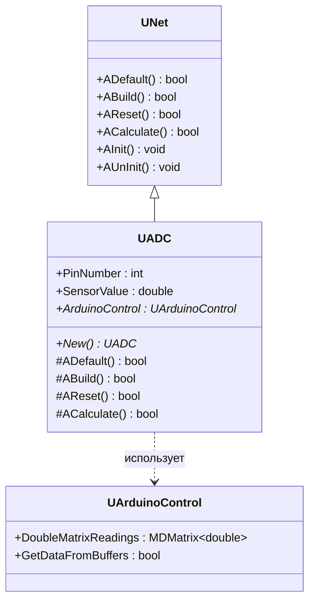
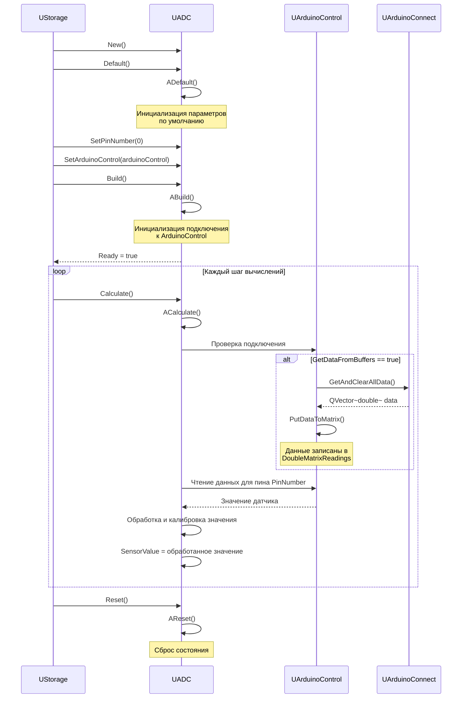
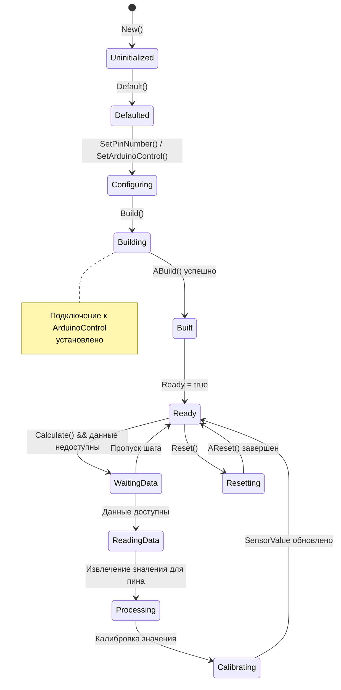
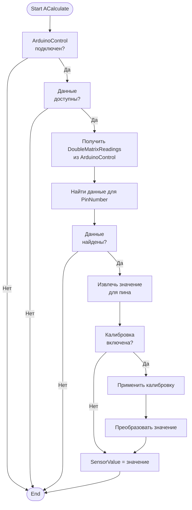
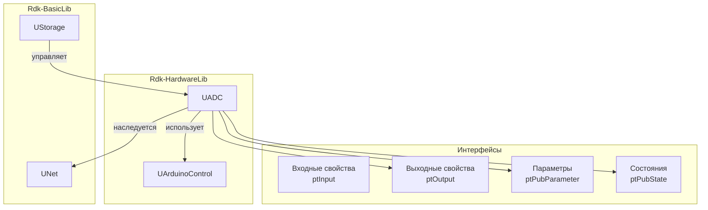
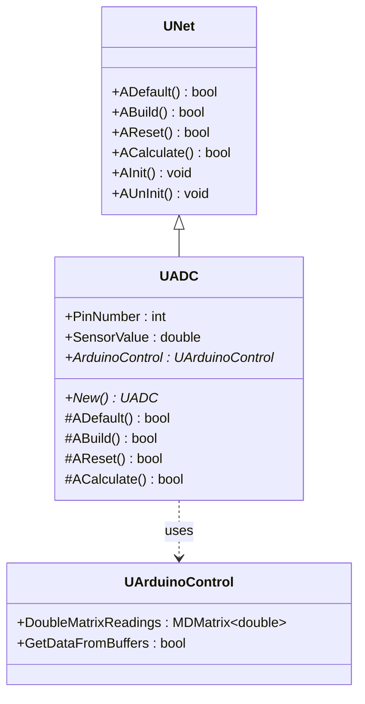
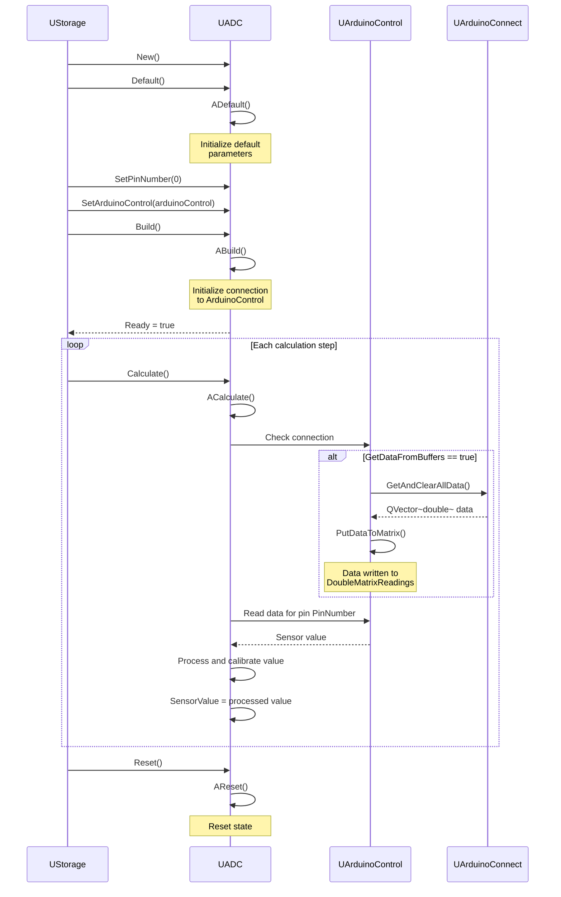
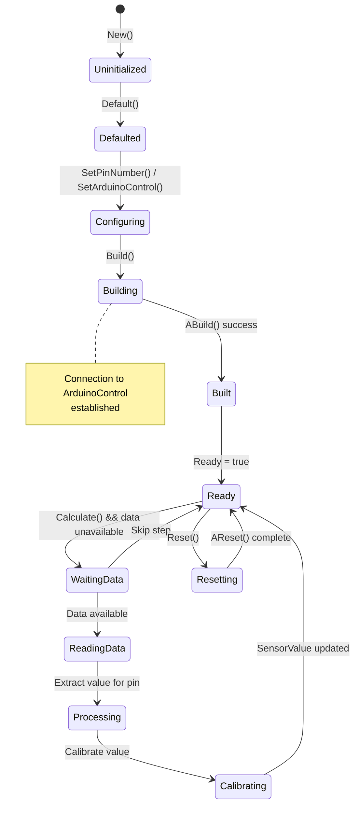
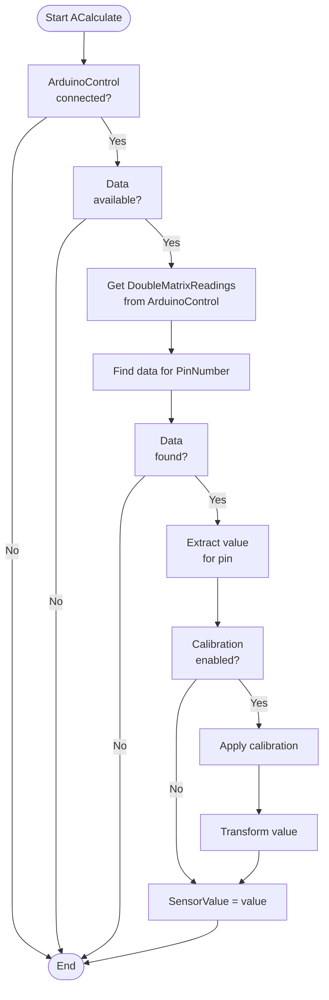
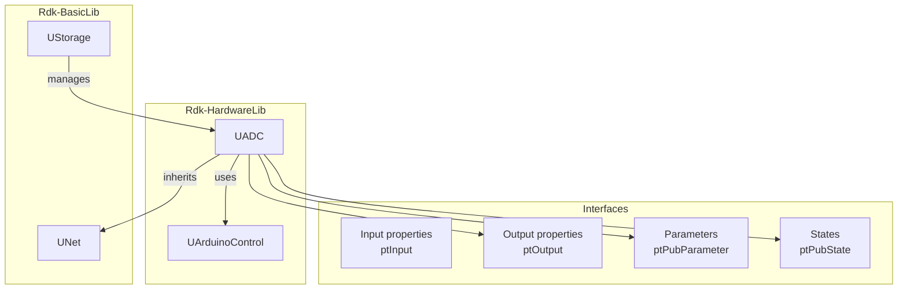

# ADC — аналоговый сенсор (Rdk-HardwareLib)

## RU

### Назначение

**Класс**: `UADC` — компонент для работы с аналоговыми датчиками через ADC (Analog-to-Digital Converter) Arduino.  
**Регистрация**: `UHardwareLibrary.cpp` → `UploadClass("ADC", ...)`.  
**Storage-инстансы**: `ClassName = "ADC"` в `Bin/Configs/*/Model_*.xml`.

`UADC` расширяет `UNet` функциональностью чтения аналоговых значений с пинов Arduino. Позволяет читать значения с аналоговых входов, выполнять калибровку датчиков и преобразование значений. В текущей реализации класс является базовым и требует расширения для полной функциональности.

**Примечание:** Текущая реализация компонента минимальна (пустой класс). Документация описывает предполагаемый интерфейс на основе архитектуры библиотеки и примеров использования.

### UML-диаграмма классов



**Иерархия наследования:**
- `UNet` — базовый класс сетевого компонента из Rdk-BasicLib
- `UADC` — компонент для работы с аналоговыми датчиками

**Связи с другими компонентами:**
- `UADC` использует `UArduinoControl` для получения данных с Arduino (зависимость)
- `UArduinoControl` предоставляет данные через `DoubleMatrixReadings`

**Примечание:** В текущей реализации класс `UADC` пустой. Предполагаемый интерфейс описан на основе архитектуры библиотеки и примеров использования.

### UML-диаграмма последовательности



**Жизненный цикл (предполагаемый):**
1. **Создание** — компонент создается через конструктор
2. **Инициализация** — установка параметров по умолчанию через `ADefault()`
3. **Настройка** — установка номера пина и ссылки на `UArduinoControl`
4. **Сборка** — инициализация подключения к `UArduinoControl` через `ABuild()`
5. **Вычисления** — в каждом шаге:
   - Получение данных из `UArduinoControl`
   - Извлечение значения для указанного пина
   - Обработка и калибровка значения
   - Обновление `SensorValue`
6. **Сброс** — сброс состояния через `AReset()`

### UML-диаграмма состояний



**Состояния (предполагаемые):**
- **Uninitialized** — создан, но не инициализирован
- **Defaulted** — параметры установлены по умолчанию
- **Configuring** — настройка параметров (номер пина, ArduinoControl)
- **Building** — выполняется сборка структуры
- **Built** — структура построена, подключение установлено
- **Ready** — готов к выполнению расчетов
- **WaitingData** — ожидание данных от ArduinoControl
- **ReadingData** — чтение данных из ArduinoControl
- **Processing** — обработка данных для указанного пина
- **Calibrating** — калибровка значения датчика
- **Resetting** — выполняется сброс состояний

### UML-диаграмма активности



**Алгоритм работы ACalculate() (предполагаемый):**
1. Проверка наличия подключения к `UArduinoControl`
2. Проверка доступности данных в `DoubleMatrixReadings`
3. Поиск данных для указанного пина (`PinNumber`)
4. Извлечение значения для пина
5. Применение калибровки (если включена)
6. Преобразование значения (если необходимо)
7. Обновление `SensorValue`

### UML-диаграмма компонентов



**Зависимости:**
- **Rdk-BasicLib** — базовые классы (`UNet`, `UStorage`, `UProperty`)
- **UArduinoControl** — компонент управления Arduino (для получения данных)

**Интерфейсы (предполагаемые):**
- **Входы** — свойства с флагом `ptInput`: отсутствуют
- **Выходы** — свойства с флагом `ptOutput`: `SensorValue`
- **Параметры** — свойства с флагом `ptPubParameter`: `PinNumber`, `ArduinoControl`
- **Состояния** — свойства с флагом `ptPubState`: `SensorValue`

### Свойства

**Примечание:** В текущей реализации класс пустой. Свойства описаны на основе предполагаемого интерфейса.

#### Параметры (ptPubParameter) — предполагаемые

- **`PinNumber`** (int) — номер аналогового пина Arduino для чтения (A0-A5, соответствующие пинам 14-19). Значение по умолчанию: не установлено. Диапазон: 0-5 (A0-A5) или 14-19 (номера пинов).

- **`ArduinoControl`** (UArduinoControl*) — указатель на компонент `UArduinoControl`, используемый для получения данных с Arduino. Значение по умолчанию: `nullptr`.

#### Состояния (ptPubState) — предполагаемые

- **`SensorValue`** (double, ptPubState | ptOutput) — текущее значение аналогового датчика. Обновляется в каждом шаге `ACalculate()` на основе данных из `UArduinoControl`. Может быть использовано как выходное свойство для связи с другими компонентами. Значение по умолчанию: 0.0. Диапазон: 0.0-1023.0 (для 10-битного ADC) или нормализованное значение 0.0-1.0.

### Методы

**Примечание:** В текущей реализации класс пустой. Методы описаны на основе предполагаемого интерфейса.

#### Публичные методы — предполагаемые

- **`New()`** → `UADC*` — создает новый экземпляр класса. Используется системой `UStorage` для создания компонентов.

#### Защищенные методы жизненного цикла — предполагаемые

- **`ADefault()`** → `bool` — инициализирует параметры по умолчанию. Устанавливает `PinNumber = 0`, `ArduinoControl = nullptr`, `SensorValue = 0.0`. Вызывается автоматически при `Default()`. Возвращает `true`.

- **`ABuild()`** → `bool` — строит внутреннюю структуру компонента. Проверяет наличие `ArduinoControl`, инициализирует подключение. Вызывается автоматически при `Build()`. Возвращает `true` при успешной сборке.

- **`AReset()`** → `bool` — сбрасывает состояние компонента. Сбрасывает `SensorValue` в 0.0. Вызывается автоматически при `Reset()`. Возвращает `true`.

- **`ACalculate()`** → `bool` — выполняет расчет компонента на каждом шаге. Получает данные из `UArduinoControl`, извлекает значение для указанного пина, применяет калибровку и обновляет `SensorValue`. Вызывается автоматически при `Calculate()`. Возвращает `true`.

#### Защищенные методы инициализации — предполагаемые

- **`AInit()`** → `void` — инициализация компонента. В текущей реализации пустой. Вызывается автоматически при `Init()`.

- **`AUnInit()`** → `void` — деинициализация компонента. Очищает ссылки на `ArduinoControl`. Вызывается автоматически при `UnInit()`.

### Примеры использования в C++

**Примечание:** Примеры основаны на предполагаемом интерфейсе компонента.

#### Пример 1: Создание и настройка компонента

```cpp
// Создание компонента управления Arduino
auto arduinoControl = storage->CreateComponent<UArduinoControl>();
arduinoControl->SetName("ArduinoControl1");
arduinoControl->PortToConnect = "COM3";
arduinoControl->MatrixCols = 100;
arduinoControl->GetDataFromBuffers = true;
arduinoControl->Build();

// Создание компонента ADC
auto adcSensor = storage->CreateComponent<UADC>();
adcSensor->SetName("ADCSensor1");

// Инициализация
adcSensor->Default();

// Настройка параметров
adcSensor->PinNumber = 0;  // A0
adcSensor->ArduinoControl = arduinoControl;

// Сборка
adcSensor->Build();

// Использование
for (int step = 0; step < 1000; step++) {
    // Обновление данных в ArduinoControl
    arduinoControl->Calculate();
    
    // Чтение значения датчика
    adcSensor->Calculate();
    
    // Получение значения
    double sensorValue = adcSensor->SensorValue;
    std::cout << "Step " << step << ": Sensor Value = " 
              << sensorValue << std::endl;
}
```

#### Пример 2: Использование выходного соединения

```cpp
// Создание компонента ADC
auto adcSensor = storage->CreateComponent<UADC>();
adcSensor->SetName("ADCSensor1");
adcSensor->PinNumber = 1;  // A1
adcSensor->ArduinoControl = arduinoControl;
adcSensor->Build();

// Создание компонента-получателя данных
auto dataProcessor = storage->CreateComponent<UStatisticDoubleMatrix>();
dataProcessor->SetName("DataProcessor");

// Создание связи
storage->CreateLink(adcSensor->SensorValue, dataProcessor->Input);

// В цикле расчетов значения будут автоматически передаваться
// из ADCSensor в DataProcessor
```

#### Пример 3: Работа с несколькими датчиками

```cpp
// Создание нескольких датчиков ADC
auto adcSensor0 = storage->CreateComponent<UADC>();
adcSensor0->SetName("ADCSensor0");
adcSensor0->PinNumber = 0;  // A0
adcSensor0->ArduinoControl = arduinoControl;
adcSensor0->Build();

auto adcSensor1 = storage->CreateComponent<UADC>();
adcSensor1->SetName("ADCSensor1");
adcSensor1->PinNumber = 1;  // A1
adcSensor1->ArduinoControl = arduinoControl;
adcSensor1->Build();

// В цикле расчетов
arduinoControl->Calculate();
adcSensor0->Calculate();
adcSensor1->Calculate();

double value0 = adcSensor0->SensorValue;
double value1 = adcSensor1->SensorValue;
```

### Примеры конфигурации XML

**Примечание:** Примеры основаны на предполагаемом интерфейсе компонента.

#### Пример 1: Базовая конфигурация

```xml
<Model Class="NModel">
    <Components>
        <ArduinoControl1 Class="Arduino">
            <Parameters>
                <PortToConnect>COM3</PortToConnect>
                <MatrixCols>100</MatrixCols>
                <GetDataFromBuffers>true</GetDataFromBuffers>
            </Parameters>
        </ArduinoControl1>
        
        <ADCSensor1 Class="ADC">
            <Parameters>
                <PinNumber>0</PinNumber>
            </Parameters>
        </ADCSensor1>
    </Components>
    
    <Links>
        <elem>
            <Item>ArduinoControl1</Item>
            <Connector>ADCSensor1.ArduinoControl</Connector>
        </elem>
    </Links>
</Model>
```

#### Пример 2: Конфигурация с выходным соединением

```xml
<Model Class="NModel">
    <Components>
        <ArduinoControl1 Class="Arduino">
            <Parameters>
                <PortToConnect>/dev/ttyUSB0</PortToConnect>
                <MatrixCols>50</MatrixCols>
                <GetDataFromBuffers>true</GetDataFromBuffers>
            </Parameters>
        </ArduinoControl1>
        
        <ADCSensor1 Class="ADC">
            <Parameters>
                <PinNumber>1</PinNumber>
            </Parameters>
        </ADCSensor1>
        
        <DataProcessor Class="UStatisticDoubleMatrix">
            <Parameters>
                <!-- Параметры обработки данных -->
            </Parameters>
        </DataProcessor>
    </Components>
    
    <Links>
        <elem>
            <Item>ArduinoControl1</Item>
            <Connector>ADCSensor1.ArduinoControl</Connector>
        </elem>
        <elem>
            <Item>ADCSensor1.SensorValue</Item>
            <Connector>DataProcessor.Input</Connector>
        </elem>
    </Links>
</Model>
```

#### Пример 3: Конфигурация с несколькими датчиками

```xml
<Model Class="NModel">
    <Components>
        <ArduinoControl1 Class="Arduino">
            <Parameters>
                <PortToConnect>COM3</PortToConnect>
                <MatrixCols>200</MatrixCols>
                <GetDataFromBuffers>true</GetDataFromBuffers>
            </Parameters>
        </ArduinoControl1>
        
        <ADCSensor0 Class="ADC">
            <Parameters>
                <PinNumber>0</PinNumber>
            </Parameters>
        </ADCSensor0>
        
        <ADCSensor1 Class="ADC">
            <Parameters>
                <PinNumber>1</PinNumber>
            </Parameters>
        </ADCSensor1>
        
        <ADCSensor2 Class="ADC">
            <Parameters>
                <PinNumber>2</PinNumber>
            </Parameters>
        </ADCSensor2>
    </Components>
    
    <Links>
        <elem>
            <Item>ArduinoControl1</Item>
            <Connector>ADCSensor0.ArduinoControl</Connector>
        </elem>
        <elem>
            <Item>ArduinoControl1</Item>
            <Connector>ADCSensor1.ArduinoControl</Connector>
        </elem>
        <elem>
            <Item>ArduinoControl1</Item>
            <Connector>ADCSensor2.ArduinoControl</Connector>
        </elem>
    </Links>
</Model>
```

### Использование в конфигурациях

`UADC` используется для чтения аналоговых значений с датчиков Arduino в конфигурационных проектах. Типичные сценарии использования:

1. **Чтение данных с датчиков** — получение значений с аналоговых входов Arduino (A0-A5)
2. **Интеграция с обработкой данных** — передача значений через выходное свойство `SensorValue` другим компонентам
3. **Мониторинг нескольких датчиков** — создание нескольких экземпляров `UADC` для разных пинов

**Типичные значения параметров:**
- **PinNumber**: 0-5 (A0-A5) или 14-19 (номера пинов Arduino)
- **ArduinoControl**: ссылка на компонент `UArduinoControl`, настроенный для работы с Arduino

**Примечание:** В текущей реализации компонент требует доработки для полной функциональности. Предполагается, что компонент будет получать данные из `DoubleMatrixReadings` компонента `UArduinoControl` и извлекать значения для указанного пина.

### См. также

- [`UArduinoControl`](Arduino.md) — компонент управления Arduino
- [`UDcControlDemo`](DC.md) — компонент управления DC-двигателем
- [Architecture.md](../Architecture.md) — архитектура библиотеки

---

## EN

### Purpose

**Class**: `UADC` — component for working with analog sensors via Arduino ADC (Analog-to-Digital Converter).  
**Registration**: `UHardwareLibrary.cpp` → `UploadClass("ADC", ...)`.  
**Storage instances**: `ClassName = "ADC"` in `Bin/Configs/*/Model_*.xml`.

`UADC` extends `UNet` with functionality for reading analog values from Arduino pins. Allows reading values from analog inputs, performing sensor calibration, and value transformation. In the current implementation the class is basic and requires extension for full functionality.

**Note:** The current component implementation is minimal (empty class). Documentation describes the expected interface based on library architecture and usage examples.

### UML Class Diagram



**Inheritance hierarchy:**
- `UNet` — base network component class from Rdk-BasicLib
- `UADC` — component for working with analog sensors

**Relationships with other components:**
- `UADC` uses `UArduinoControl` to obtain data from Arduino (dependency)
- `UArduinoControl` provides data via `DoubleMatrixReadings`

**Note:** In the current implementation the `UADC` class is empty. The expected interface is described based on library architecture and usage examples.

### UML Sequence Diagram



**Lifecycle (expected):**
1. **Creation** — component is created via constructor
2. **Initialization** — default parameters set via `ADefault()`
3. **Configuration** — pin number and `UArduinoControl` reference set
4. **Build** — connection to `UArduinoControl` initialized via `ABuild()`
5. **Calculation** — on each step:
   - Obtain data from `UArduinoControl`
   - Extract value for the specified pin
   - Process and calibrate value
   - Update `SensorValue`
6. **Reset** — state reset via `AReset()`

### UML State Diagram



**States (expected):**
- **Uninitialized** — created but not initialized
- **Defaulted** — default parameters set
- **Configuring** — configuring parameters (pin number, ArduinoControl)
- **Building** — structure build in progress
- **Built** — structure built, connection established
- **Ready** — ready for calculations
- **WaitingData** — waiting for data from ArduinoControl
- **ReadingData** — reading data from ArduinoControl
- **Processing** — processing data for specified pin
- **Calibrating** — calibrating sensor value
- **Resetting** — state reset in progress

### UML Activity Diagram



**ACalculate() algorithm (expected):**
1. Check connection to `UArduinoControl`
2. Check data availability in `DoubleMatrixReadings`
3. Find data for the specified pin (`PinNumber`)
4. Extract value for the pin
5. Apply calibration (if enabled)
6. Transform value (if necessary)
7. Update `SensorValue`

### UML Component Diagram



**Dependencies:**
- **Rdk-BasicLib** — base classes (`UNet`, `UStorage`, `UProperty`)
- **UArduinoControl** — Arduino control component (for data acquisition)

**Interfaces (expected):**
- **Inputs** — properties with `ptInput` flag: none
- **Outputs** — properties with `ptOutput` flag: `SensorValue`
- **Parameters** — properties with `ptPubParameter` flag: `PinNumber`, `ArduinoControl`
- **States** — properties with `ptPubState` flag: `SensorValue`

### Properties

**Note:** In the current implementation the class is empty. Properties are described based on the expected interface.

#### Parameters (ptPubParameter) — expected

- **`PinNumber`** (int) — Arduino analog pin number for reading (A0-A5, corresponding to pins 14-19). Default: not set. Range: 0-5 (A0-A5) or 14-19 (pin numbers).

- **`ArduinoControl`** (UArduinoControl*) — pointer to the `UArduinoControl` component used to obtain data from Arduino. Default: `nullptr`.

#### States (ptPubState) — expected

- **`SensorValue`** (double, ptPubState | ptOutput) — current analog sensor value. Updated on each `ACalculate()` step based on data from `UArduinoControl`. Can be used as an output property for connection to other components. Default: 0.0. Range: 0.0-1023.0 (for 10-bit ADC) or normalized value 0.0-1.0.

### Methods

**Note:** In the current implementation the class is empty. Methods are described based on the expected interface.

#### Public methods — expected

- **`New()`** → `UADC*` — creates a new class instance. Used by the `UStorage` system to create components.

#### Protected lifecycle methods — expected

- **`ADefault()`** → `bool` — initializes default parameters. Sets `PinNumber = 0`, `ArduinoControl = nullptr`, `SensorValue = 0.0`. Called automatically on `Default()`. Returns `true`.

- **`ABuild()`** → `bool` — builds internal component structure. Checks for `ArduinoControl`, initializes connection. Called automatically on `Build()`. Returns `true` on successful build.

- **`AReset()`** → `bool` — resets component state. Resets `SensorValue` to 0.0. Called automatically on `Reset()`. Returns `true`.

- **`ACalculate()`** → `bool` — performs component calculation on each step. Obtains data from `UArduinoControl`, extracts value for the specified pin, applies calibration, and updates `SensorValue`. Called automatically on `Calculate()`. Returns `true`.

#### Protected initialization methods — expected

- **`AInit()`** → `void` — component initialization. Empty in current implementation. Called automatically on `Init()`.

- **`AUnInit()`** → `void` — component deinitialization. Clears references to `ArduinoControl`. Called automatically on `UnInit()`.

### Usage Examples in C++

**Note:** Examples are based on the expected component interface.

#### Example 1: Creating and configuring the component

```cpp
// Create Arduino control component
auto arduinoControl = storage->CreateComponent<UArduinoControl>();
arduinoControl->SetName("ArduinoControl1");
arduinoControl->PortToConnect = "COM3";
arduinoControl->MatrixCols = 100;
arduinoControl->GetDataFromBuffers = true;
arduinoControl->Build();

// Create ADC component
auto adcSensor = storage->CreateComponent<UADC>();
adcSensor->SetName("ADCSensor1");

// Initialization
adcSensor->Default();

// Configure parameters
adcSensor->PinNumber = 0;  // A0
adcSensor->ArduinoControl = arduinoControl;

// Build
adcSensor->Build();

// Usage
for (int step = 0; step < 1000; step++) {
    // Update data in ArduinoControl
    arduinoControl->Calculate();
    
    // Read sensor value
    adcSensor->Calculate();
    
    // Get value
    double sensorValue = adcSensor->SensorValue;
    std::cout << "Step " << step << ": Sensor Value = " 
              << sensorValue << std::endl;
}
```

#### Example 2: Using output connection

```cpp
// Create ADC component
auto adcSensor = storage->CreateComponent<UADC>();
adcSensor->SetName("ADCSensor1");
adcSensor->PinNumber = 1;  // A1
adcSensor->ArduinoControl = arduinoControl;
adcSensor->Build();

// Create data receiver component
auto dataProcessor = storage->CreateComponent<UStatisticDoubleMatrix>();
dataProcessor->SetName("DataProcessor");

// Create link
storage->CreateLink(adcSensor->SensorValue, dataProcessor->Input);

// In the calculation loop values are automatically transferred
// from ADCSensor to DataProcessor
```

#### Example 3: Working with multiple sensors

```cpp
// Create multiple ADC sensors
auto adcSensor0 = storage->CreateComponent<UADC>();
adcSensor0->SetName("ADCSensor0");
adcSensor0->PinNumber = 0;  // A0
adcSensor0->ArduinoControl = arduinoControl;
adcSensor0->Build();

auto adcSensor1 = storage->CreateComponent<UADC>();
adcSensor1->SetName("ADCSensor1");
adcSensor1->PinNumber = 1;  // A1
adcSensor1->ArduinoControl = arduinoControl;
adcSensor1->Build();

// In calculation loop
arduinoControl->Calculate();
adcSensor0->Calculate();
adcSensor1->Calculate();

double value0 = adcSensor0->SensorValue;
double value1 = adcSensor1->SensorValue;
```

### XML Configuration Examples

**Note:** Examples are based on the expected component interface.

#### Example 1: Basic configuration

```xml
<Model Class="NModel">
    <Components>
        <ArduinoControl1 Class="Arduino">
            <Parameters>
                <PortToConnect>COM3</PortToConnect>
                <MatrixCols>100</MatrixCols>
                <GetDataFromBuffers>true</GetDataFromBuffers>
            </Parameters>
        </ArduinoControl1>
        
        <ADCSensor1 Class="ADC">
            <Parameters>
                <PinNumber>0</PinNumber>
            </Parameters>
        </ADCSensor1>
    </Components>
    
    <Links>
        <elem>
            <Item>ArduinoControl1</Item>
            <Connector>ADCSensor1.ArduinoControl</Connector>
        </elem>
    </Links>
</Model>
```

#### Example 2: Configuration with output connection

```xml
<Model Class="NModel">
    <Components>
        <ArduinoControl1 Class="Arduino">
            <Parameters>
                <PortToConnect>/dev/ttyUSB0</PortToConnect>
                <MatrixCols>50</MatrixCols>
                <GetDataFromBuffers>true</GetDataFromBuffers>
            </Parameters>
        </ArduinoControl1>
        
        <ADCSensor1 Class="ADC">
            <Parameters>
                <PinNumber>1</PinNumber>
            </Parameters>
        </ADCSensor1>
        
        <DataProcessor Class="UStatisticDoubleMatrix">
            <Parameters>
                <!-- Data processing parameters -->
            </Parameters>
        </DataProcessor>
    </Components>
    
    <Links>
        <elem>
            <Item>ArduinoControl1</Item>
            <Connector>ADCSensor1.ArduinoControl</Connector>
        </elem>
        <elem>
            <Item>ADCSensor1.SensorValue</Item>
            <Connector>DataProcessor.Input</Connector>
        </elem>
    </Links>
</Model>
```

#### Example 3: Configuration with multiple sensors

```xml
<Model Class="NModel">
    <Components>
        <ArduinoControl1 Class="Arduino">
            <Parameters>
                <PortToConnect>COM3</PortToConnect>
                <MatrixCols>200</MatrixCols>
                <GetDataFromBuffers>true</GetDataFromBuffers>
            </Parameters>
        </ArduinoControl1>
        
        <ADCSensor0 Class="ADC">
            <Parameters>
                <PinNumber>0</PinNumber>
            </Parameters>
        </ADCSensor0>
        
        <ADCSensor1 Class="ADC">
            <Parameters>
                <PinNumber>1</PinNumber>
            </Parameters>
        </ADCSensor1>
        
        <ADCSensor2 Class="ADC">
            <Parameters>
                <PinNumber>2</PinNumber>
            </Parameters>
        </ADCSensor2>
    </Components>
    
    <Links>
        <elem>
            <Item>ArduinoControl1</Item>
            <Connector>ADCSensor0.ArduinoControl</Connector>
        </elem>
        <elem>
            <Item>ArduinoControl1</Item>
            <Connector>ADCSensor1.ArduinoControl</Connector>
        </elem>
        <elem>
            <Item>ArduinoControl1</Item>
            <Connector>ADCSensor2.ArduinoControl</Connector>
        </elem>
    </Links>
</Model>
```

### Usage in Configurations

`UADC` is used to read analog sensor values from Arduino in configuration projects. Typical use cases:

1. **Reading sensor data** — obtaining values from Arduino analog inputs (A0-A5)
2. **Data processing integration** — passing values via `SensorValue` output property to other components
3. **Monitoring multiple sensors** — creating multiple `UADC` instances for different pins

**Typical parameter values:**
- **PinNumber**: 0-5 (A0-A5) or 14-19 (Arduino pin numbers)
- **ArduinoControl**: reference to `UArduinoControl` component configured for Arduino

**Note:** In the current implementation the component requires further development for full functionality. It is expected that the component will obtain data from `UArduinoControl`'s `DoubleMatrixReadings` and extract values for the specified pin.

### See Also

- [`UArduinoControl`](Arduino.md) — Arduino control component
- [`UDcControlDemo`](DC.md) — DC motor control component
- [Architecture.md](../Architecture.md) — library architecture
