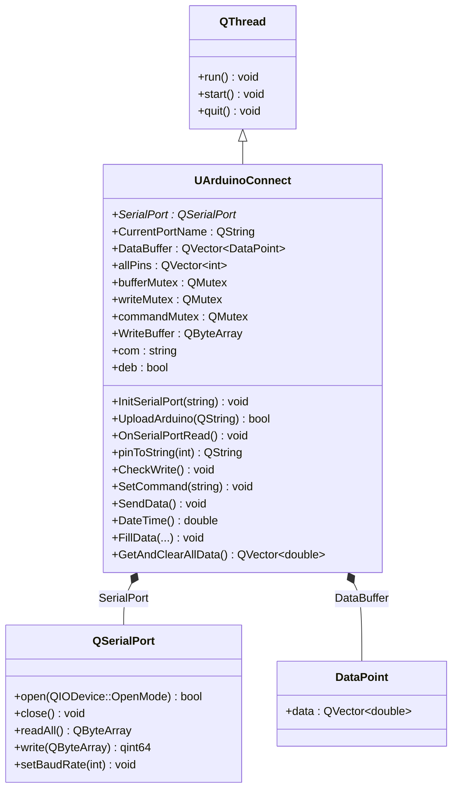
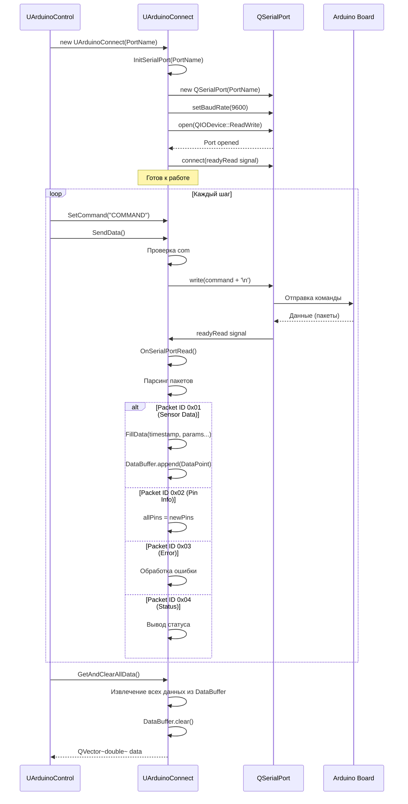
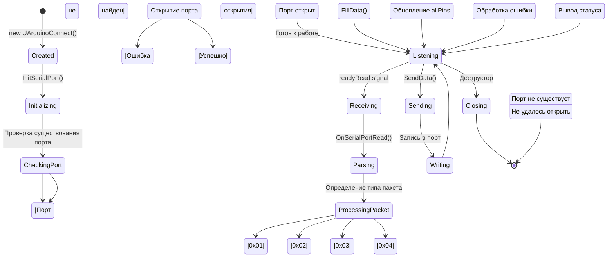
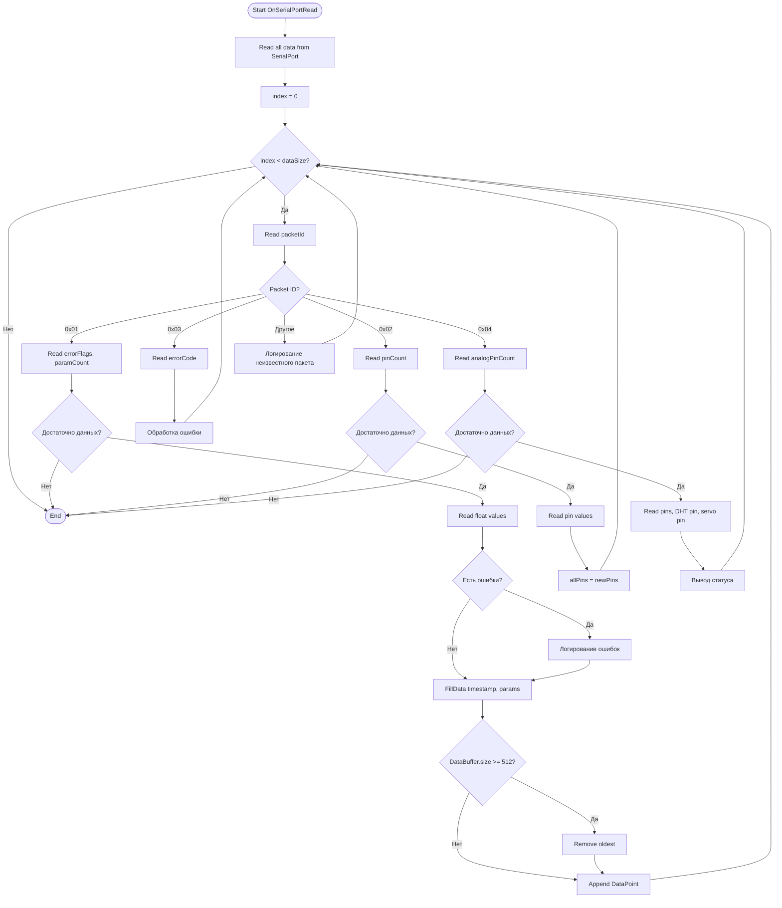
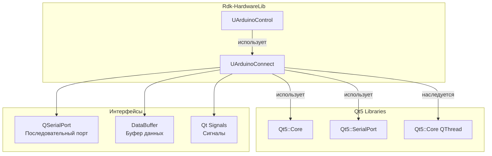
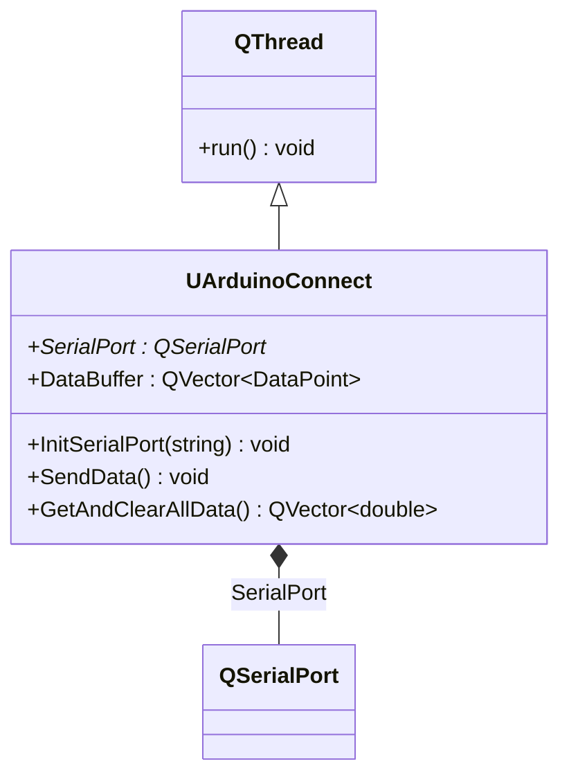
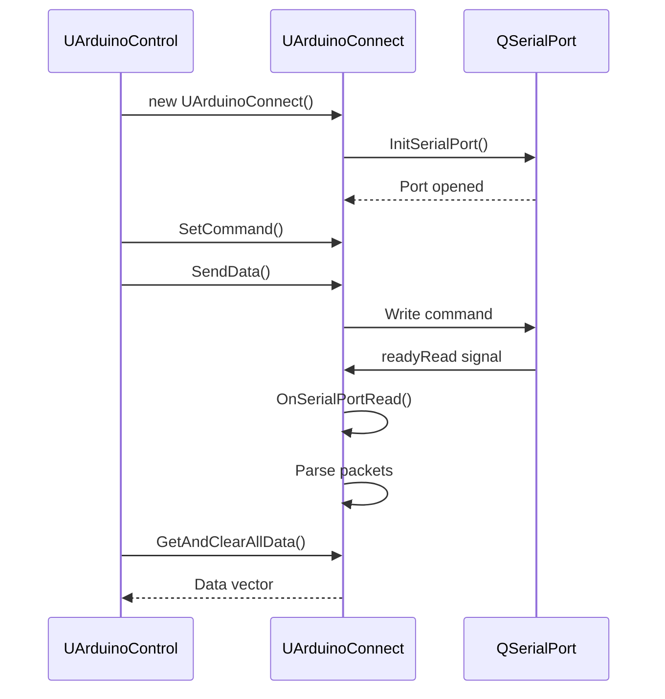
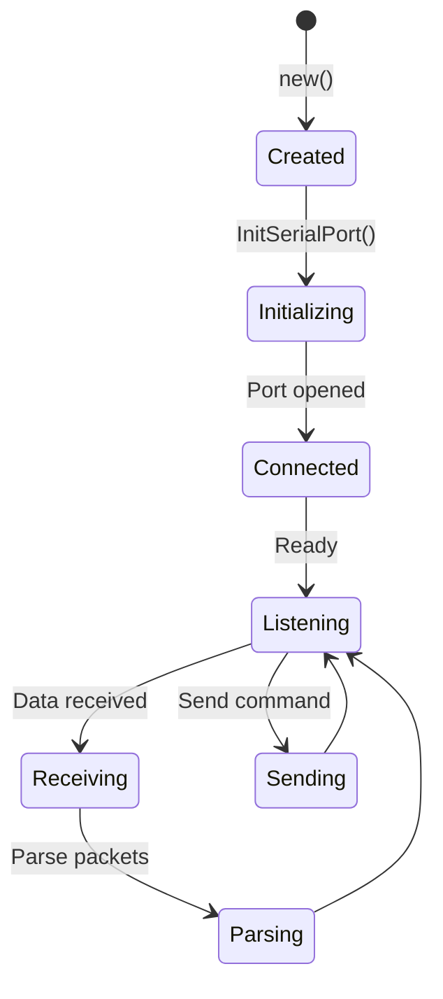
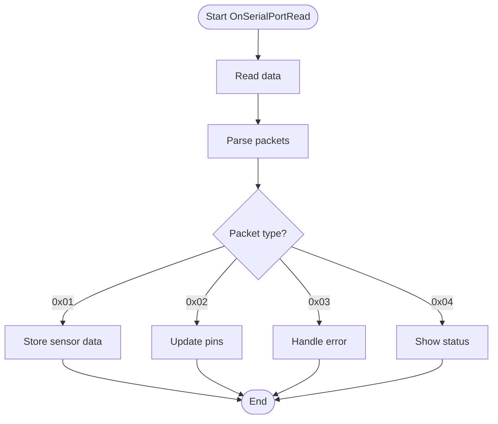

# ArduinoConnect — вспомогательный класс подключения к Arduino (Rdk-HardwareLib)

> **Устарело:** `UArduinoConnect` удалён. Функции перенесены в `UArduinoSerialSession`, `UArduinoBinaryStreamParser` и `UArduinoCustomLink` / `UArduinoSensorSketch`. Актуальный каталог: [Component-Catalog.md](../Component-Catalog.md). Ниже — историческая документация.

## RU

### Назначение

**Класс (исторический)**: `UArduinoConnect` — вспомогательный класс для работы с последовательным портом Arduino.  
**Тип**: Вспомогательный класс (не Storage-компонент).  
**Использование**: Используется внутри `UArduinoControl` для управления последовательным портом.

`UArduinoConnect` наследуется от `QThread` и обеспечивает низкоуровневую работу с последовательным портом Arduino. Управляет подключением, отправкой команд, получением данных, буферизацией и парсингом пакетов данных от Arduino. Не является Storage-компонентом и не регистрируется через `UploadClass`, но является критически важной частью архитектуры библиотеки.

**Примечание:** Этот класс не является Storage-компонентом и не может быть создан напрямую через `storage->CreateComponent<>()`. Он используется внутри `UArduinoControl` и создается автоматически.

### UML-диаграмма классов



**Иерархия наследования:**
- `QThread` — базовый класс Qt для многопоточности
- `UArduinoConnect` — класс подключения к Arduino

**Связи:**
- `UArduinoConnect` использует `QSerialPort` для работы с последовательным портом
- `UArduinoConnect` хранит данные в `DataBuffer` (вектор `DataPoint`)
- `UArduinoControl` использует `UArduinoConnect` (композиция)

### UML-диаграмма последовательности



**Жизненный цикл:**
1. **Создание** — объект создается в `UArduinoControl::ACalculate()` при первом вызове
2. **Инициализация** — вызов `InitSerialPort()` для открытия последовательного порта
3. **Работа** — в отдельном потоке (наследуется от `QThread`):
   - Отправка команд через `SendData()`
   - Получение данных через сигнал `readyRead`
   - Парсинг пакетов в `OnSerialPortRead()`
   - Буферизация данных в `DataBuffer`
4. **Получение данных** — `UArduinoControl` вызывает `GetAndClearAllData()` для получения данных
5. **Уничтожение** — объект уничтожается в `UArduinoControl::AUnInit()`

### UML-диаграмма состояний



**Состояния:**
- **Created** — объект создан
- **Initializing** — выполняется инициализация порта
- **CheckingPort** — проверка существования порта
- **Opening** — открытие последовательного порта
- **Connected** — порт открыт и готов к работе
- **Listening** — ожидание данных и команд
- **Receiving** — получение данных от Arduino
- **Parsing** — парсинг полученных данных
- **ProcessingPacket** — определение типа пакета
- **StoringSensorData** — сохранение данных датчиков
- **UpdatingPins** — обновление конфигурации пинов
- **HandlingError** — обработка ошибок
- **ShowingStatus** — вывод статуса
- **Sending** — отправка команды
- **Writing** — запись данных в порт
- **Closing** — закрытие порта и уничтожение объекта
- **Error** — состояние ошибки

### UML-диаграмма активности



**Алгоритм работы OnSerialPortRead():**
1. Чтение всех данных из последовательного порта
2. Парсинг пакетов по байтам:
   - Чтение ID пакета (первый байт)
   - Обработка в зависимости от типа пакета:
     - **0x01** — данные датчиков: чтение флагов ошибок, количества параметров, значений float, сохранение в буфер
     - **0x02** — информация о пинах: чтение количества пинов, значений пинов, обновление `allPins`
     - **0x03** — ошибки: чтение кода ошибки, обработка
     - **0x04** — статус: чтение конфигурации пинов, вывод статуса
3. Продолжение парсинга до конца данных

### UML-диаграмма компонентов



**Зависимости:**
- **Qt5::Core** — базовые классы Qt (`QThread`, `QObject`, `QMutex`, `QDateTime`)
- **Qt5::SerialPort** — работа с последовательными портами (`QSerialPort`, `QSerialPortInfo`)

**Интерфейсы:**
- **Последовательный порт** — работа через `QSerialPort`
- **Буфер данных** — хранение данных в `DataBuffer` (вектор `DataPoint`)
- **Qt Signals** — сигналы для асинхронной работы (`readyRead`, `UploadFinished`, `DataReceived`, `SerialPortConnected`)

### Структура данных

#### DataPoint

Структура для хранения одной точки данных:

```cpp
struct DataPoint {
    QVector<double> data;  // Формат: [timestamp, paramCount, param1, param2, ...]
};
```

**Формат данных:**
- `data[0]` — timestamp (время получения данных)
- `data[1]` — paramCount (количество параметров)
- `data[2]` — param1 (первый параметр, например, temperature)
- `data[3]` — param2 (второй параметр, например, humidity)
- `data[4]` — param3 (третий параметр, например, mfield)
- `data[5]` — param4 (четвертый параметр, например, servo_speed)

### Свойства и поля

#### Публичные поля

- **`SerialPort`** (QSerialPort*) — указатель на объект последовательного порта. Создается в `InitSerialPort()`, уничтожается в деструкторе.

- **`CurrentPortName`** (QString) — имя текущего COM-порта (например, "COM3", "/dev/ttyUSB0").

- **`DataBuffer`** (QVector<DataPoint>) — буфер для хранения данных от Arduino. Максимальный размер: 512 точек данных. При переполнении удаляется самая старая точка.

- **`allPins`** (QVector<int>) — вектор конфигурации пинов Arduino. Обновляется при получении пакета типа 0x02.

- **`bufferMutex`** (QMutex) — мьютекс для синхронизации доступа к `DataBuffer`.

- **`writeMutex`** (QMutex) — мьютекс для синхронизации записи в порт.

- **`commandMutex`** (QMutex) — мьютекс для синхронизации доступа к команде `com`.

- **`WriteBuffer`** (QByteArray) — буфер для записи команд в порт. Максимальный размер: 4096 байт.

- **`com`** (string) — текущая команда для отправки. Устанавливается через `SetCommand()`, очищается после отправки.

- **`deb`** (bool) — флаг отладочного вывода. Устанавливается из `UArduinoControl->ShowDebug`.

### Методы

#### Публичные методы

- **`InitSerialPort(string &PortName)`** → `void` — инициализирует последовательный порт. Проверяет существование порта, создает `QSerialPort`, устанавливает скорость 9600 бод, открывает порт для чтения/записи, подключает сигнал `readyRead` к `OnSerialPortRead()`. Параметры:
  - `PortName` (string&) — имя COM-порта

- **`UploadArduino(const QString &FileName)`** → `bool` — загружает прошивку на Arduino через avrdude. Использует `QProcess` для запуска команды avrdude. Параметры:
  - `FileName` (const QString&) — путь к файлу прошивки (.hex)
  
  Возвращает: `true` при успешной загрузке, `false` при ошибке

- **`OnSerialPortRead()`** → `void` — обработчик сигнала `readyRead` от `QSerialPort`. Читает данные из порта, парсит пакеты по протоколу и обрабатывает их в зависимости от типа пакета.

- **`pinToString(int pin)`** → `QString` — преобразует номер пина в строковое представление. Для аналоговых пинов (14-19) возвращает "A0"-"A5", для цифровых (2-13) возвращает "D2"-"D13". Параметры:
  - `pin` (int) — номер пина

- **`CheckWrite()`** → `void` — проверяет возможность записи в порт и отправляет данные из `WriteBuffer`, если порт готов.

- **`SetCommand(string& cmd)`** → `void` — устанавливает команду для отправки. Команда сохраняется в `com` и отправляется при вызове `SendData()`. Параметры:
  - `cmd` (string&) — команда для отправки

- **`SendData()`** → `void` — отправляет команду из `com` на Arduino. Преобразует команду в UTF-8, добавляет символ новой строки, добавляет в `WriteBuffer` и вызывает `CheckWrite()` для отправки.

- **`DateTime()`** → `double` — возвращает текущее время в формате HHMMSS (часы, минуты, секунды). Используется для timestamp в данных датчиков.

- **`FillData(double timestamp, uint8_t paramCount, float temperature, float humidity, float mfield, float servo_speed)`** → `void` — добавляет точку данных в буфер. Создает `DataPoint`, заполняет данными и добавляет в `DataBuffer`. При переполнении буфера (>= 512 точек) удаляет самую старую точку. Параметры:
  - `timestamp` (double) — время получения данных
  - `paramCount` (uint8_t) — количество параметров
  - `temperature` (float) — температура
  - `humidity` (float) — влажность
  - `mfield` (float) — магнитное поле
  - `servo_speed` (float) — скорость сервопривода

- **`GetAndClearAllData()`** → `QVector<double>` — извлекает все данные из `DataBuffer` и очищает буфер. Возвращает вектор всех данных из всех точек данных. Используется `UArduinoControl` для получения данных.

#### Конструктор и деструктор

- **`UArduinoConnect(string &PortName)`** — конструктор. Инициализирует `SerialPort = nullptr`, `com = ""`, `deb = ""`, вызывает `InitSerialPort(PortName)`.

- **`~UArduinoConnect()`** — деструктор. Закрывает последовательный порт, если он открыт, и освобождает память.

### Протокол обмена данными

Класс использует бинарный протокол обмена данными с Arduino:

#### Типы пакетов

1. **0x01 — Данные датчиков**
   - Структура: `[packetId(1), errorFlags(1), paramCount(1), param1(4), param2(4), ...]`
   - `errorFlags`: битовые флаги ошибок (0x01 — температура, 0x02 — влажность, 0x04 — датчик Холла)
   - `paramCount`: количество параметров (1-4)
   - Параметры: float значения (4 байта каждое)

2. **0x02 — Информация о пинах**
   - Структура: `[packetId(1), pinCount(1), pin1(1), pin2(1), ...]`
   - `pinCount`: количество пинов
   - Пины: номера пинов (1 байт каждый)

3. **0x03 — Ошибки**
   - Структура: `[packetId(1), errorCode(1)]`
   - `errorCode`: код ошибки (0x01 — DHT Sensor Failure, 0x02 — Hall Sensor Failure, 0x03 — Analog Sensor Failure)

4. **0x04 — Статус**
   - Структура: `[packetId(1), analogPinCount(1), analogPin1(1), ..., dhtPin(1), servoPin(1)]`
   - `analogPinCount`: количество аналоговых пинов
   - Аналоговые пины: номера пинов
   - `dhtPin`: номер пина DHT датчика
   - `servoPin`: номер пина сервопривода

#### Отправка команд

Команды отправляются в текстовом формате UTF-8 с символом новой строки (`\n`) в конце. Команды буферизуются в `WriteBuffer` и отправляются асинхронно.

### Примеры использования

**Примечание:** `UArduinoConnect` не используется напрямую в коде приложения. Он создается и управляется внутри `UArduinoControl`. Примеры показаны для понимания внутренней работы.

#### Пример 1: Создание и использование (внутри UArduinoControl)

```cpp
// Внутри UArduinoControl::ACalculate()
if (UArdConn == nullptr) {
    string portName = PortToConnect;
    UArdConn = new UArduinoConnect(portName);
    // UArduinoConnect автоматически инициализирует порт в конструкторе
}

// Установка команды
UArdConn->SetCommand("READ_SENSORS");

// Отправка команды
UArdConn->SendData();

// Получение данных
QVector<double> allData = UArdConn->GetAndClearAllData();
```

#### Пример 2: Обработка данных

```cpp
// Данные приходят автоматически через сигнал readyRead
// Внутри OnSerialPortRead() происходит парсинг пакетов

// После парсинга данные сохраняются в DataBuffer
// UArduinoControl получает данные через GetAndClearAllData()
```

### Использование в конфигурациях

`UArduinoConnect` не используется напрямую в XML-конфигурациях, так как не является Storage-компонентом. Он создается автоматически внутри `UArduinoControl` при первом вызове `ACalculate()`.

### См. также

- [`UArduinoControl`](Arduino.md) — компонент управления Arduino (использует `UArduinoConnect`)
- [Architecture.md](../Architecture.md) — архитектура библиотеки

---

## EN

### Purpose

**Class**: `UArduinoConnect` — helper class for Arduino serial port communication.  
**Type**: Helper class (not a Storage component).  
**Usage**: Used internally by `UArduinoControl` for serial port management.

`UArduinoConnect` extends `QThread` and provides low-level serial port communication with Arduino. Manages connection, command sending, data receiving, buffering, and packet parsing. Not a Storage component and not registered via `UploadClass`, but is a critical part of the library architecture.

**Note:** This class is not a Storage component and cannot be created directly via `storage->CreateComponent<>()`. It is used internally by `UArduinoControl` and created automatically.

### UML Class Diagram



### UML Sequence Diagram



### UML State Diagram



### UML Activity Diagram



### Properties and Fields

#### Public Fields

- **`SerialPort`** (QSerialPort*) — pointer to serial port object
- **`CurrentPortName`** (QString) — current COM port name
- **`DataBuffer`** (QVector<DataPoint>) — buffer for storing data from Arduino (max 512 points)
- **`allPins`** (QVector<int>) — vector of pin configuration
- **`bufferMutex`** (QMutex) — mutex for `DataBuffer` synchronization
- **`writeMutex`** (QMutex) — mutex for write synchronization
- **`commandMutex`** (QMutex) — mutex for command synchronization
- **`WriteBuffer`** (QByteArray) — buffer for writing commands (max 4096 bytes)
- **`com`** (string) — current command to send
- **`deb`** (bool) — debug output flag

### Methods

#### Public Methods

- **`InitSerialPort(string &PortName)`** → `void` — initializes serial port
- **`UploadArduino(const QString &FileName)`** → `bool` — uploads firmware to Arduino via avrdude
- **`OnSerialPortRead()`** → `void` — handler for `readyRead` signal, parses incoming packets
- **`pinToString(int pin)`** → `QString` — converts pin number to string representation
- **`CheckWrite()`** → `void` — checks if port is ready and sends data from `WriteBuffer`
- **`SetCommand(string& cmd)`** → `void` — sets command to send
- **`SendData()`** → `void` — sends command from `com` to Arduino
- **`DateTime()`** → `double` — returns current time as HHMMSS
- **`FillData(...)`** → `void` — adds data point to buffer
- **`GetAndClearAllData()`** → `QVector<double>` — extracts all data from buffer and clears it

### Communication Protocol

Binary protocol for data exchange with Arduino:

- **0x01** — Sensor data: `[packetId, errorFlags, paramCount, param1(float), param2(float), ...]`
- **0x02** — Pin information: `[packetId, pinCount, pin1, pin2, ...]`
- **0x03** — Errors: `[packetId, errorCode]`
- **0x04** — Status: `[packetId, analogPinCount, analogPins..., dhtPin, servoPin]`

Commands are sent as UTF-8 text with newline character (`\n`) at the end.

### See also

- [`UArduinoControl`](Arduino.md) — Arduino control component (uses `UArduinoConnect`)
- [Architecture.md](../Architecture.md) — library architecture
