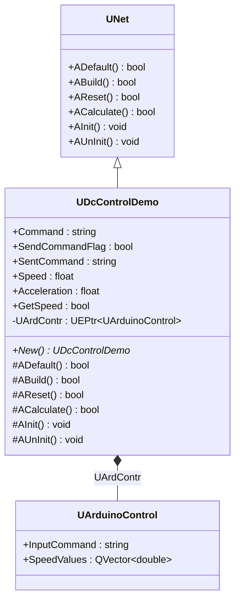
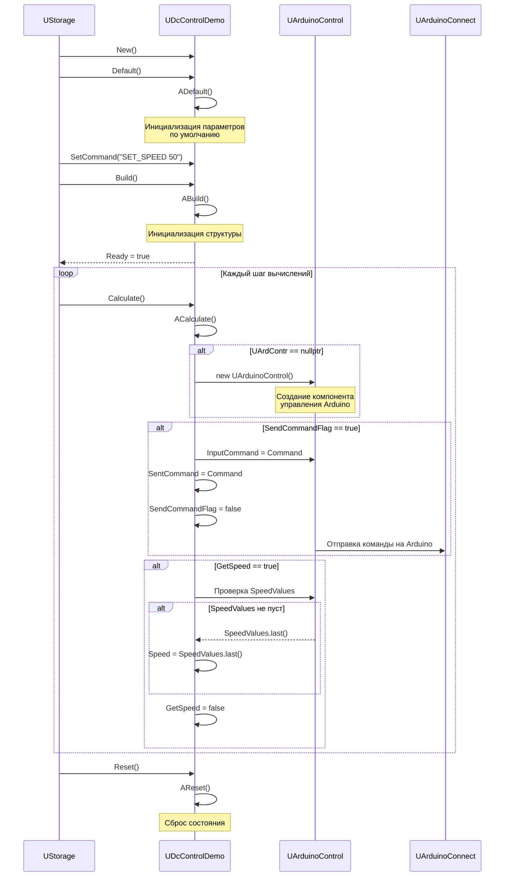
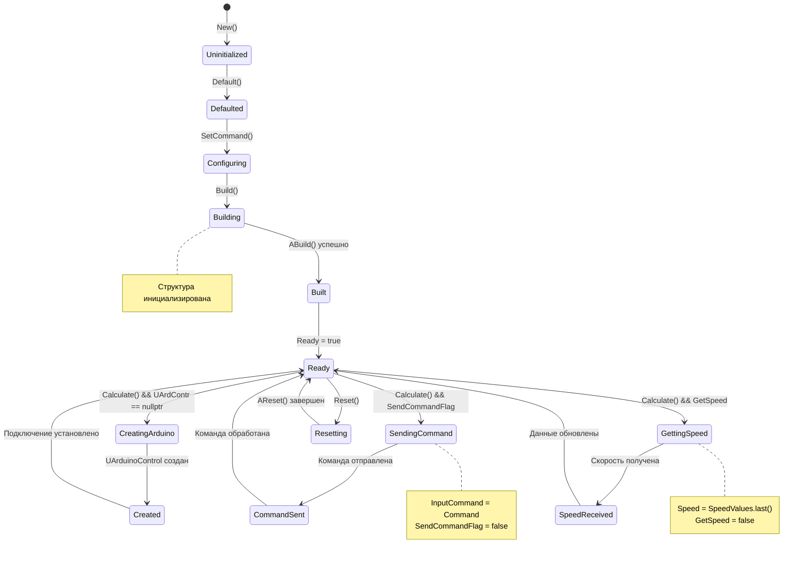
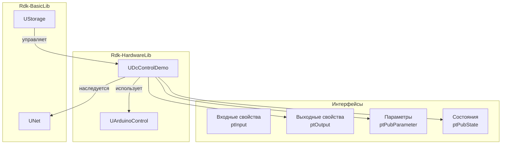
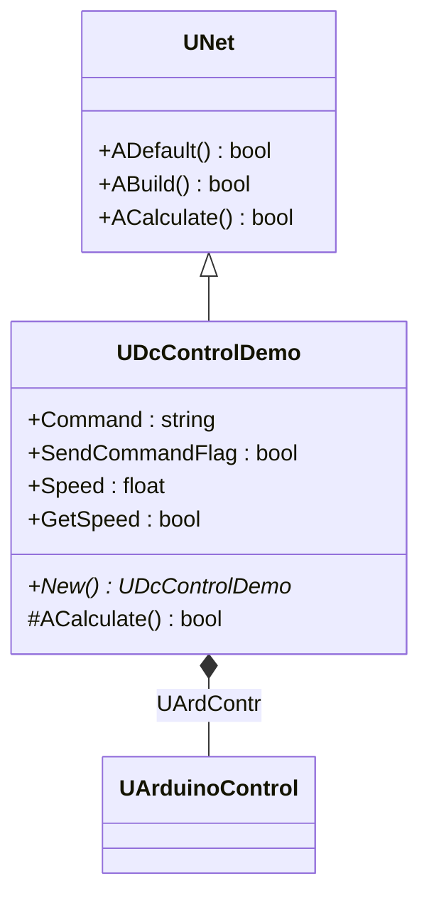
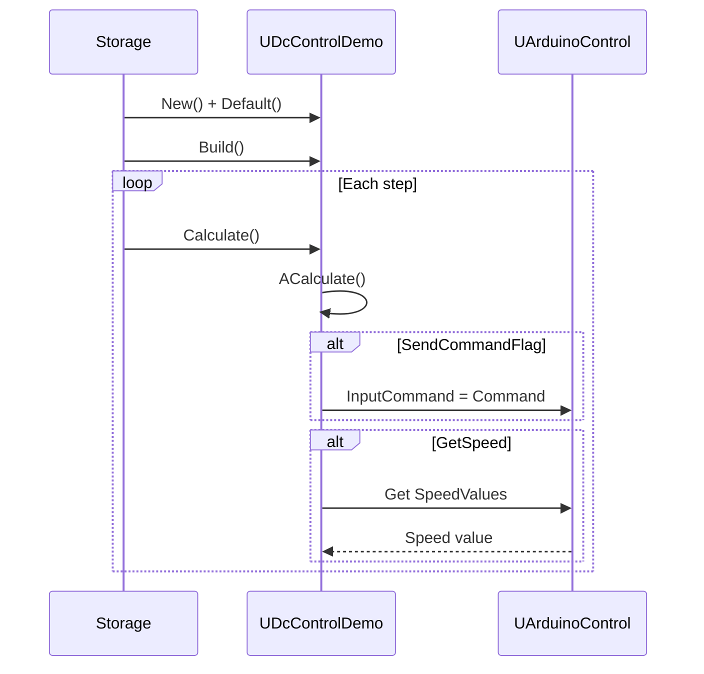
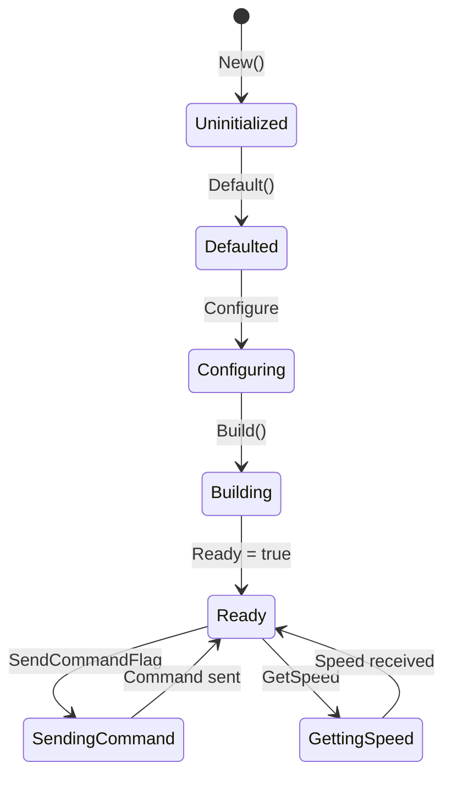
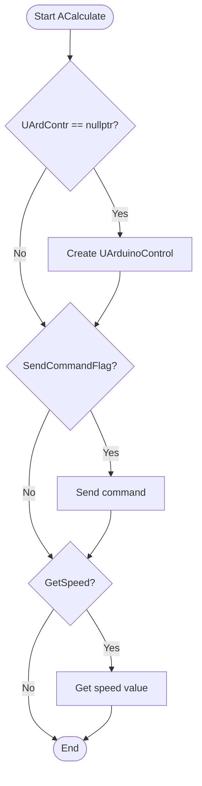
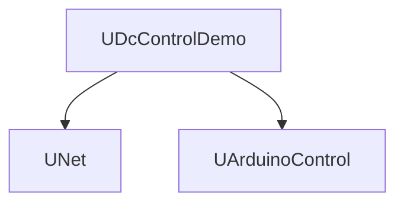

# DC — управление DC-двигателем (Rdk-HardwareLib)

## RU

### Назначение

**Класс**: `UDcControlDemo` — демонстрационный компонент для управления DC-двигателем через Arduino.  
**Регистрация**: `UHardwareLibrary.cpp` → `UploadClass("DC", ...)`.  
**Storage-инстансы**: `ClassName = "DC"` в `Bin/Configs/*/Model_*.xml`.

`UDcControlDemo` расширяет `UNet` функциональностью управления DC-двигателем через Arduino. Позволяет отправлять команды управления двигателем (скорость, направление), получать обратную связь по скорости и ускорению. Использует `UArduinoControl` для отправки команд на Arduino.

### UML-диаграмма классов



**Иерархия наследования:**
- `UNet` — базовый класс сетевого компонента из Rdk-BasicLib
- `UDcControlDemo` — компонент управления DC-двигателем

**Связи с другими компонентами:**
- `UDcControlDemo` использует `UArduinoControl` (композиция через `UEPtr`) для отправки команд на Arduino
- `UArduinoControl` предоставляет данные о скорости через `SpeedValues`

### UML-диаграмма последовательности



**Жизненный цикл:**
1. **Создание** — компонент создается через конструктор
2. **Инициализация** — установка параметров по умолчанию через `ADefault()`
3. **Настройка** — установка команды управления через `Command`
4. **Сборка** — инициализация структуры через `ABuild()`
5. **Вычисления** — в каждом шаге:
   - Проверка и создание `UArduinoControl` при необходимости
   - Отправка команды через `InputCommand` (если `SendCommandFlag == true`)
   - Получение скорости из `UArduinoControl->SpeedValues` (если `GetSpeed == true`)
6. **Сброс** — сброс состояния через `AReset()`

### UML-диаграмма состояний



**Состояния:**
- **Uninitialized** — создан, но не инициализирован
- **Defaulted** — параметры установлены по умолчанию
- **Configuring** — настройка параметров (команда управления)
- **Building** — выполняется сборка структуры
- **Built** — структура построена
- **Ready** — готов к выполнению расчетов
- **CreatingArduino** — создается компонент `UArduinoControl`
- **Created** — компонент `UArduinoControl` создан
- **SendingCommand** — отправка команды на Arduino
- **CommandSent** — команда отправлена
- **GettingSpeed** — получение скорости двигателя
- **SpeedReceived** — скорость получена
- **Resetting** — выполняется сброс состояний

### UML-диаграмма активности

```mermaid
flowchart TD
    Start([Start ACalculate]) --> CheckArduino{UArdContr == nullptr?}
    CheckArduino -->|Да| CreateArduino[Создать UArduinoControl]
    CreateArduino --> CheckSendFlag
    CheckArduino -->|Нет| CheckSendFlag{SendCommandFlag?}
    CheckSendFlag -->|Да| SetInputCommand[UArdContr->InputCommand = Command]
    SetInputCommand --> SetSentCommand[SentCommand = Command]
    SetSentCommand --> ClearFlag[SendCommandFlag = false]
    ClearFlag --> CheckGetSpeed
    CheckSendFlag -->|Нет| CheckGetSpeed{GetSpeed?}
    CheckGetSpeed -->|Да| CheckSpeedValues["SpeedValues<br/>не пуст?"]
    CheckSpeedValues -->|Да| GetLastSpeed[Speed = SpeedValues.last()]
    CheckSpeedValues -->|Нет| ClearGetSpeed
    GetLastSpeed --> ClearGetSpeed[GetSpeed = false]
    CheckGetSpeed -->|Нет| End
    ClearGetSpeed --> End([End])
```

**Алгоритм работы ACalculate():**
1. Проверка наличия `UArduinoControl`, создание при необходимости
2. Если `SendCommandFlag == true`:
   - Установка `UArdContr->InputCommand = Command`
   - Сохранение команды в `SentCommand`
   - Сброс `SendCommandFlag = false`
3. Если `GetSpeed == true`:
   - Проверка наличия данных в `UArdContr->SpeedValues`
   - Если данные есть: установка `Speed = SpeedValues.last()`
   - Сброс `GetSpeed = false`

### UML-диаграмма компонентов



**Зависимости:**
- **Rdk-BasicLib** — базовые классы (`UNet`, `UStorage`, `UProperty`)
- **UArduinoControl** — компонент управления Arduino (для отправки команд и получения данных)

**Интерфейсы:**
- **Входы** — свойства с флагом `ptInput`: отсутствуют
- **Выходы** — свойства с флагом `ptOutput`: `Command`
- **Параметры** — свойства с флагом `ptPubParameter`: `Command`
- **Состояния** — свойства с флагом `ptPubState`: `SendCommandFlag`, `SentCommand`, `Speed`, `Acceleration`, `GetSpeed`

### Свойства

#### Параметры (ptPubParameter)

- **`Command`** (string, ptPubParameter | ptOutput) — команда для управления DC-двигателем. Может быть установлена как параметр или использована как выходное свойство для связи с другими компонентами. Команда отправляется на Arduino через `UArduinoControl->InputCommand` при установке `SendCommandFlag = true`. Формат команды зависит от протокола Arduino (например, "SET_SPEED 50", "SET_DIRECTION FORWARD"). Значение по умолчанию: пустая строка.

#### Состояния (ptPubState)

- **`SendCommandFlag`** (bool) — флаг для отправки команды из свойства `Command`. При установке в `true` в `ACalculate()` команда передается в `UArduinoControl->InputCommand`, после чего флаг сбрасывается в `false`. Значение по умолчанию: `false`.

- **`SentCommand`** (string) — последняя отправленная команда. Обновляется после установки команды в `UArduinoControl->InputCommand`. Значение по умолчанию: пустая строка.

- **`Speed`** (float) — текущая скорость двигателя. Обновляется из `UArduinoControl->SpeedValues.last()` при установке `GetSpeed = true`. Значение по умолчанию: 0.0. Диапазон: зависит от протокола Arduino и типа двигателя.

- **`Acceleration`** (float) — текущее ускорение двигателя. В текущей реализации не обновляется автоматически. Значение по умолчанию: 0.0.

- **`GetSpeed`** (bool) — флаг для получения скорости двигателя. При установке в `true` в `ACalculate()` скорость читается из `UArduinoControl->SpeedValues`, после чего флаг сбрасывается в `false`. Значение по умолчанию: `false`.

#### Защищенные поля

- **`UArdContr`** (UEPtr<UArduinoControl>) — указатель на объект управления Arduino. Создается автоматически в `ACalculate()` при первом вызове, если равен `nullptr`. Освобождается в `AUnInit()`.

### Методы

#### Публичные методы

- **`New()`** → `UDcControlDemo*` — создает новый экземпляр класса. Используется системой `UStorage` для создания компонентов.

#### Защищенные методы жизненного цикла

- **`ADefault()`** → `bool` — инициализирует параметры по умолчанию. В текущей реализации всегда возвращает `true`. Вызывается автоматически при `Default()`.

- **`ABuild()`** → `bool` — строит внутреннюю структуру компонента. В текущей реализации всегда возвращает `true`. Вызывается автоматически при `Build()`. Возвращает `true` при успешной сборке.

- **`AReset()`** → `bool` — сбрасывает состояние компонента. В текущей реализации всегда возвращает `true`. Вызывается автоматически при `Reset()`. Возвращает `true`.

- **`ACalculate()`** → `bool` — выполняет расчет компонента на каждом шаге. Проверяет и создает `UArduinoControl` при необходимости, обрабатывает команды и получает данные о скорости. Вызывается автоматически при `Calculate()`. Возвращает `true`.

#### Защищенные методы инициализации

- **`AInit()`** → `void` — инициализация компонента. В текущей реализации пустой. Вызывается автоматически при `Init()`.

- **`AUnInit()`** → `void` — деинициализация компонента. В текущей реализации пустой. Вызывается автоматически при `UnInit()`.

### Примеры использования в C++

#### Пример 1: Создание и настройка компонента

```cpp
// Создание компонента управления DC-двигателем
auto dcControl = storage->CreateComponent<UDcControlDemo>();
dcControl->SetName("DCMotor1");

// Инициализация
dcControl->Default();

// Настройка параметров
dcControl->Command = "SET_SPEED 50";

// Сборка
dcControl->Build();

// Использование
for (int step = 0; step < 1000; step++) {
    // Установка команды для отправки
    dcControl->Command = "SET_SPEED " + std::to_string(step % 100);
    dcControl->SendCommandFlag = true;
    
    // Получение скорости
    dcControl->GetSpeed = true;
    
    // Выполнение расчета
    dcControl->Calculate();
    
    // Получение данных
    float speed = dcControl->Speed;
    std::string sentCommand = dcControl->SentCommand;
    
    std::cout << "Step " << step << ": Command=" << sentCommand 
              << ", Speed=" << speed << std::endl;
}
```

#### Пример 2: Использование выходного соединения

```cpp
// Создание компонента-источника команды
auto commandSource = storage->CreateComponent<UScalarSource>();
commandSource->SetName("CommandSource");

// Создание компонента управления DC-двигателем
auto dcControl = storage->CreateComponent<UDcControlDemo>();
dcControl->SetName("DCMotor1");
dcControl->Build();

// Создание связи
storage->CreateLink(commandSource->Output, dcControl->Command);

// В цикле расчетов команды будут автоматически передаваться
// из CommandSource в DCMotor через Command
// Для отправки команды нужно установить SendCommandFlag = true
```

#### Пример 3: Управление скоростью с обратной связью

```cpp
auto dcControl = storage->CreateComponent<UDcControlDemo>();
dcControl->SetName("DCMotor1");
dcControl->Build();

// Целевая скорость
float targetSpeed = 75.0f;

for (int step = 0; step < 1000; step++) {
    // Получение текущей скорости
    dcControl->GetSpeed = true;
    dcControl->Calculate();
    float currentSpeed = dcControl->Speed;
    
    // ПИД-регулятор (упрощенный)
    float error = targetSpeed - currentSpeed;
    float controlSignal = error * 0.1f;  // Простое пропорциональное управление
    
    // Установка новой команды
    dcControl->Command = "SET_SPEED " + std::to_string(static_cast<int>(controlSignal));
    dcControl->SendCommandFlag = true;
    
    // Выполнение расчета
    dcControl->Calculate();
    
    std::cout << "Step " << step << ": Target=" << targetSpeed 
              << ", Current=" << currentSpeed 
              << ", Error=" << error << std::endl;
}
```

### Примеры конфигурации XML

#### Пример 1: Базовая конфигурация

```xml
<Model Class="NModel">
    <Components>
        <ArduinoControl1 Class="Arduino">
            <Parameters>
                <PortToConnect>COM3</PortToConnect>
                <MatrixCols>100</MatrixCols>
            </Parameters>
        </ArduinoControl1>
        
        <DCMotor1 Class="DC">
            <Parameters>
                <Command>SET_SPEED 50</Command>
            </Parameters>
        </DCMotor1>
    </Components>
</Model>
```

#### Пример 2: Конфигурация с входным соединением

```xml
<Model Class="NModel">
    <Components>
        <ArduinoControl1 Class="Arduino">
            <Parameters>
                <PortToConnect>/dev/ttyUSB0</PortToConnect>
                <MatrixCols>50</MatrixCols>
            </Parameters>
        </ArduinoControl1>
        
        <CommandSource Class="UScalarSource">
            <Parameters>
                <Value>"SET_SPEED 75"</Value>
            </Parameters>
        </CommandSource>
        
        <DCMotor1 Class="DC">
            <Parameters>
                <SendCommandFlag>true</SendCommandFlag>
            </Parameters>
        </DCMotor1>
    </Components>
    
    <Links>
        <elem>
            <Item>CommandSource.Output</Item>
            <Connector>DCMotor1.Command</Connector>
        </elem>
    </Links>
</Model>
```

#### Пример 3: Конфигурация с мониторингом скорости

```xml
<Model Class="NModel">
    <Components>
        <ArduinoControl1 Class="Arduino">
            <Parameters>
                <PortToConnect>COM3</PortToConnect>
                <MatrixCols>200</MatrixCols>
                <GetDataFromBuffers>true</GetDataFromBuffers>
            </Parameters>
        </ArduinoControl1>
        
        <DCMotor1 Class="DC">
            <Parameters>
                <Command>SET_SPEED 60</Command>
                <SendCommandFlag>true</SendCommandFlag>
                <GetSpeed>true</GetSpeed>
            </Parameters>
        </DCMotor1>
        
        <SpeedMonitor Class="UStatisticDoubleMatrix">
            <Parameters>
                <!-- Параметры мониторинга скорости -->
            </Parameters>
        </SpeedMonitor>
    </Components>
    
    <Links>
        <elem>
            <Item>DCMotor1.Speed</Item>
            <Connector>SpeedMonitor.Input</Connector>
        </elem>
    </Links>
</Model>
```

### Использование в конфигурациях

`UDcControlDemo` используется для управления DC-двигателями через Arduino в конфигурационных проектах. Типичные сценарии использования:

1. **Управление скоростью** — отправка команд для установки скорости двигателя через `Command` и `SendCommandFlag`
2. **Управление направлением** — отправка команд для изменения направления вращения
3. **Обратная связь** — получение данных о текущей скорости через `GetSpeed` и `Speed`
4. **Интеграция с контроллерами** — использование `Command` как выходного свойства для связи с другими компонентами

**Типичные значения параметров:**
- **Command**: "SET_SPEED 50", "SET_DIRECTION FORWARD", "SET_DIRECTION REVERSE", "STOP" (зависит от протокола Arduino)
- **SendCommandFlag**: `true` для отправки команды, `false` после отправки
- **GetSpeed**: `true` для получения скорости, `false` после получения

**Формат команд (примерный, зависит от протокола Arduino):**
- `SET_SPEED <value>` — установка скорости (0-100 или 0-255)
- `SET_DIRECTION <FORWARD|REVERSE>` — установка направления
- `STOP` — остановка двигателя
- `BRAKE` — торможение двигателя

### См. также

- [`UArduinoControl`](Arduino.md) — компонент управления Arduino
- [`UADC`](ADC.md) — компонент для работы с аналоговыми датчиками
- [Architecture.md](../Architecture.md) — архитектура библиотеки

---

## EN

### Purpose

**Class**: `UDcControlDemo` — demonstration component for DC motor control via Arduino.  
**Registration**: `UHardwareLibrary.cpp` → `UploadClass("DC", ...)`.  
**Instances**: `ClassName = "DC"` in `Bin/Configs/*/Model_*.xml`.

`UDcControlDemo` extends `UNet` with DC motor control functionality. Allows sending motor control commands (speed, direction), receiving speed and acceleration feedback. Uses `UArduinoControl` to send commands to Arduino.

### UML Class Diagram



### UML Sequence Diagram



### UML State Diagram



### UML Activity Diagram



### UML Component Diagram



### Properties

#### Parameters (ptPubParameter)

- **`Command`** (string, ptPubParameter | ptOutput) — command for DC motor control

#### States (ptPubState)

- **`SendCommandFlag`** (bool) — flag to send command
- **`SentCommand`** (string) — last sent command
- **`Speed`** (float) — current motor speed
- **`Acceleration`** (float) — current motor acceleration
- **`GetSpeed`** (bool) — flag to get speed

### Methods

#### Public Methods

- **`New()`** → `UDcControlDemo*` — creates new instance

#### Protected Lifecycle Methods

- **`ADefault()`** → `bool` — initializes default parameters
- **`ABuild()`** → `bool` — builds internal structure
- **`AReset()`** → `bool` — resets component state
- **`ACalculate()`** → `bool` — performs calculation step

### Usage Examples in C++

```cpp
auto dcControl = storage->CreateComponent<UDcControlDemo>();
dcControl->Command = "SET_SPEED 50";
dcControl->SendCommandFlag = true;
dcControl->GetSpeed = true;
dcControl->Calculate();

float speed = dcControl->Speed;
```

### XML Configuration Examples

```xml
<DCMotor1 Class="DC">
    <Parameters>
        <Command>SET_SPEED 50</Command>
        <SendCommandFlag>true</SendCommandFlag>
    </Parameters>
</DCMotor1>
```
